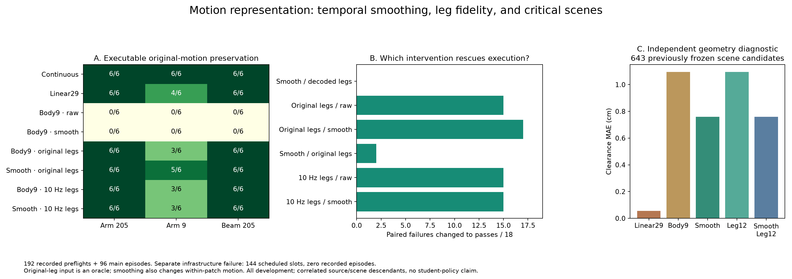

# Hindsight Motion Research

Motion representations for robust humanoid traversal: preserve executable body choices, test them through matched scene interventions, and measure their value to a future causal goal/scene controller.

**Local research workspace:** `/home/linjiw/hindsight-motion-research`.

## Research status

**Research reassessment — September 18:** keep the traversal goal; prioritize a
complete approach–duck–recover–stop baseline and compare simple continuous chunks,
native SONIC tokens and learned codecs. A new discrete tokenizer must earn its
place through execution, switching or downstream learning value. See the rewritten
[research plan](docs/RESEARCH_PLAN_zh.md), [literature review](docs/LITERATURE_REASSESSMENT_20260918_zh.md),
[proposed interface](docs/MOTION_INTERFACE_V2.md) and [repository sync](docs/REVIEW_SYNC_20260918.md).
The review itself ran no experiments. Its subsequent complete-reference pilot
passed 4/4 per method. The [matched-state continuation study](docs/CONTINUATION_ADMISSION02_RESULTS_zh.md)
now passes **8/8 per method**, with eight exactly matched handoff pairs: 16 native
attempts, 4,136 control steps, zero training. This tests supplied, same-phase
continuations on two development clips. The September 19 [selected-reference pilot](docs/SELECTION_CODEC_RESULTS_zh.md)
now passes **2/2 per method from reset**, using the same measured-state selector
and continuous planning bank. Four new attempts / 1,451 control steps, one familiar
ancestry, known map and zero training. The [six-case scene screen is now complete](docs/SELECTION_BOUNDARY_ADMISSION02_RESULTS_zh.md):
**1/3 per method**—both pass the shifted beam, contact the lower beam, and time out
at the farther goal. Admission 02 adds four runs / 1,148 control steps; the original
two runs are reused, for six total / 1,867 steps, with exact control and reference
audits. The earlier partial packet remains unchanged.

The sibling project now has a separately qualified distance-responsive exit
controller. Our [new offline codec preflight](docs/DISTANCE_CODEC_PREFLIGHT_zh.md)
replays all 1,528 public-history references exactly, while exposing a one-tick
change in Linear29's goal-response timing and a blend velocity-convention gap.
Next compare continuous and Linear29 on that frozen original/farther-beam
controller after a new registration. Its Linear29 execution is not yet measured;
generalization, cross-family robustness and downstream learning remain open.
The earlier zero-launch resource deferral remains a separate immutable record.

The latest acquisition check found **0/145** admissible portals for the qualified
CMU/107 original/tuck pair under the fixed three-perturbation geometry gate.
No new obstacle episode was launched from that comparison. A separate fixed
wide/tuck contrast is registered and prepared for six preflights, deferred after
the ten-minute resource gate expired without a launch; see the
[acquisition report](docs/CARRIER_SCENE_RESULTS_zh.md) and
[current execution status](results/carrier_scene.json).

The historical mechanism study separates temporal smoothing from leg-reconstruction accuracy:

- RVQ + anatomy residuals: **0/18** qualified preflights; smoothing alone: **0/18**.
- Adding 10 Hz leg reconstruction: **15/18**, with all six selected arm/beam intervention panels preserved. Fresh continuous controls also preserve all six.
- Eight new carrier groups screened; one passes every original + arm-tuck qualification. It still needs obstacle-scene validation.
- Cumulative: **440 recorded preflights + 312 main episodes**. One additional infrastructure failure consumed 144 scheduled preflight slots but recorded no episodes.
- Core scene acquisition remains **five edited pairs across three source groups**. Representation repeats do not add independent pairs. All development; no navigation student trained.



## Read the research

- [Interactive research atlas](https://linjiw.github.io/hindsight-motion-research/): tokenizer, measured results, intervention explorer, and the path to BFM/navigation. [Website maintenance](site/README.md).
- [Research plan (中文)](docs/RESEARCH_PLAN_zh.md)
- [Literature reassessment (中文)](docs/LITERATURE_REASSESSMENT_20260918_zh.md)
- [Proposed motion / BFM / VLA / agent interface](docs/MOTION_INTERFACE_V2.md)
- [Critical scenes → BFM → text-to-navigation roadmap](docs/ROADMAP_SCENE_BFM_TEXT2NAV.md)
- [Complete-task reference pilot: continuous 4/4, Linear29 4/4](docs/COMPLETE_TASK_RESULTS_zh.md) — [protocol](docs/COMPLETE_TASK_PROTOCOL.md)
- [Matched-state continuation: continuous 8/8, Linear29 8/8](docs/CONTINUATION_ADMISSION02_RESULTS_zh.md) — [protocol](docs/CONTINUATION_PROTOCOL.md) · [admission](docs/CONTINUATION_ADMISSION_02.md)
- [Selected-reference controller: continuous 2/2, Linear29 2/2](docs/SELECTION_CODEC_RESULTS_zh.md) — [protocol](docs/SELECTION_CODEC_PROTOCOL.md)
- [Completed scene screen: same pass/contact/deadline outcomes](docs/SELECTION_BOUNDARY_ADMISSION02_RESULTS_zh.md) — [admission 02](docs/SELECTION_BOUNDARY_ADMISSION_02.md) · [original partial receipt](docs/SELECTION_BOUNDARY_RESULTS_zh.md)
- [New distance-exit controller: offline codec preflight](docs/DISTANCE_CODEC_PREFLIGHT_zh.md) — [next gate](docs/DISTANCE_RESPONSE_GATE_zh.md)
- [Earlier composer interface sync](docs/COMPOSER_SYNC_20260918.md)
- [Adopted research guidance (中文)](docs/RESEARCH_GUIDANCE_20260918_zh.md)
- [Small-LLM interface protocol](docs/LLM_INTERFACE_PROTOCOL_zh.md) and [first CPU probe results](docs/LLM_INTERFACE_RESULTS_zh.md)
- [Latest mechanism results (中文)](docs/TOKEN_MECHANISM_RESULTS_zh.md) and [protocol](docs/TOKEN_MECHANISM_PROTOCOL.md)
- [Carrier-to-scene acquisition (中文)](docs/CARRIER_SCENE_RESULTS_zh.md) and [protocol](docs/CARRIER_SCENE_PROTOCOL.md)
- [Decoded-motion execution study](docs/DECODER_EXECUTION_zh.md)
- [Second traversal family and token comparison](docs/SECOND_FAMILY_AND_TOKENS_zh.md)
- [Public machine-readable result summaries](results/)
- [Public release scope and reproduction limits](docs/PUBLIC_RELEASE.md)
- [Local workspace guide and historical artifact links](docs/LOCAL_WORKSPACE.md)

## Repository layout

| Folder | Contents |
| --- | --- |
| `src/hindsight_motion/` | Motion coding, constrained edits, scene proposals, native execution adapters and audits |
| `tests/` | Geometry, edit, representation and evidence-contract regressions |
| `configs/` | Historical experiment registrations and local pilot configuration |
| `docs/` | Research plans, protocols, findings and evidence boundaries |
| `results/` | Selected public summary statistics |
| `artifacts/` | Selected aggregate scientific figures; embedded trajectory viewers remain local |

`runs/`, licensed motion data, checkpoints and raw rollout archives remain local and are ignored by Git.

## Setup and tests

```bash
python3.11 -m venv .venv
source .venv/bin/activate
python -m pip install -e '.[dev]'
python -m pytest -q
```

One integration test needs a local licensed reference and the native G1 URDF; it skips when those are unavailable. Native SONIC/IsaacLab execution is not bundled and is not covered by the lightweight installation above.

For an authorized local native setup:

```bash
export HINDSIGHT_RUNTIME=/path/to/compatible/sonic-runtime
export HINDSIGHT_TEACHER=/path/to/checkpoint.pt
export PYTHONPATH="$PWD/src:$HINDSIGHT_RUNTIME"
```

Configure dataset/provenance/robot paths in a copy of `configs/pilot.json` before new offline runs. Follow each experiment protocol for native reproduction; historical commands depend on their recorded run lineage. Use new output directories and retain failed attempts.

## Data and claims

This is a public code-and-results research repository, not a redistribution of AMASS or teacher training assets. Historical reports link to local-only evidence files; see [release scope](docs/PUBLIC_RELEASE.md). Geometry validation, teacher trackability, intervention evidence and downstream student utility are separate claims. Future reference information is kept out of student actor observations.
