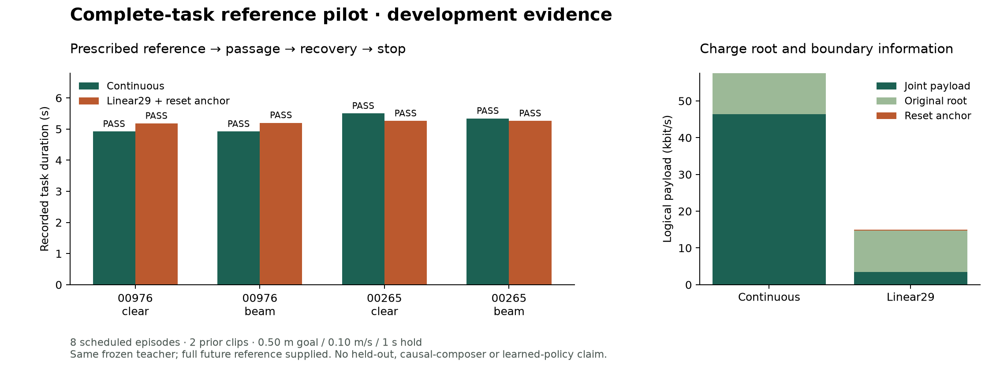

# Continuous 与 Linear29：完整参考任务支持首轮结果

2026-09-18。依据执行前冻结的[协议](COMPLETE_TASK_PROTOCOL.md)与[注册](../configs/complete_task_v1.plan.json)。**八个预定 episode 全部完成：continuous 4/4、带两帧 reset anchor 的 Linear29 4/4。** 所有配对的初始状态、速度、930D 历史和动力学字段完全相同，Torch RNG hash 相同。没有更换失败案例、重试或训练。

这填上研究计划矩阵的**第一行：给定完整参考，从 reset 测完整任务支持**。不是第三行的因果 composer，也不是新场景泛化或 learned tokenizer 收益。

## 任务与逐格结果

冻结同一 SONIC teacher，使用相邻项目既有的 00976、00265 两个 authored source clip，以及各自 clear 与 +5 mm swept-envelope beam。每个方法完成接近、通过 gate、全身离开、恢复直立与目标持续停止。Clear 没有物理横梁，保留虚拟 gate；beam 才是低障碍穿越。两种方法都收到完整未来参考与原始 root；这一实验没有要求其自主选择行为。

| Source / scene | Continuous 成功 | Linear29 成功 | Continuous 时间 | Linear29 时间 |
| --- | --- | --- | --- | --- |
| 00976 / clear | 1/1 | 1/1 | 4.92 s | 5.18 s |
| 00976 / beam | 1/1 | 1/1 | 4.92 s | 5.20 s |
| 00265 / clear | 1/1 | 1/1 | 5.50 s | 5.26 s |
| 00265 / beam | 1/1 | 1/1 | 5.34 s | 5.26 s |

四个配对都是共同成功，没有成功/失败转换。时间差有正有负，单次执行不足以比较速度优势或随机变异。两个 clip 的更高层 ancestry 独立性未证明；clear/beam 共享参考，不能当作四个独立动作来源。

## 成功实际包含什么

沿用已实现的 `whole_body_passage_upright_recovery_goal050_stop_v1`：目标 3D 距离 ≤0.50 m、速度 ≤0.10 m/s、15 个直立恢复 tick 后再完成 50 个连续 hold tick。50 Hz 控制，200 Hz contact；完整 collision envelope 越过横梁后缘至少 2 cm。直立同时检查来源固定的骨盆高度区间和躯干倾角，不能用直背蹲姿替代。

八个记录均达到完整 50-tick hold，没有跌倒，全部障碍和非脚地面法向接触峰值为 0 N。终止目标距离约 0.088–0.236 m；速度约 0.007–0.047 m/s。独立 audit 用原始 trace、逐物理步 contact 和 envelope/posture features 再检查成功尾段、15+50 的时间顺序、禁止 contact 与数据对齐，而不是只读成功布尔值。

**补充的事后检查：**八个记录的最后 50 tick 也全部在 0.25 m 内。但本轮启动/终止使用的注册 profile 仍是 0.50 m；不将这一观察回写为预注册的 0.25 m 实验。未来 tighter profile 需要单独冻结。

## 表示、成本与一个真实限制

Linear29 使用旧训练集冻结的 29 通道 scale、12-bit signed scalar、10 Hz patch-center knots，再插值到 50 Hz。两帧精确 joint reset anchor 使重建参考和 continuous 的初始 pose/velocity 一致。没有历史 0.6 s 原始进入段和 0.6 s 混合桥；但仍保留完整原始 root 和两个起始 joint frame，所以不是无辅助的因果表示。

六秒参考的逻辑 payload：

| 路线 | Joint bits | Root bits | 额外 reset anchor | 合计 |
| --- | ---: | ---: | ---: | ---: |
| Continuous | 278,400 | 67,200 | 已含在 joint 流 | 345,600 bit |
| Linear29 | 20,880 | 67,200 | 1,856 | 89,936 bit |

分别为 57,600 与约 14,989 bit/s；这是数值表示的逻辑成本，未包含文件容器、decoder/teacher 模型存储或通信实现。不要与历史 body9+leg12 对 Linear29 的 **含 root 仅 5.6%** 差值混淆：那是不同的方法对和实验。

两个 clip 各有 **240/1,740 knot 值发生 clipping**。全部位于左右 wrist pitch/yaw 四个通道：原训练 scale 为 `1e-5 rad`，旧 motion 数据在这些通道几乎不动，本次参考却有真实变化。整体 joint RMSE 分别 0.0357、0.0366 rad，最大误差 0.4205、0.1906 rad。我们没有为这些开发 clip 重拟合范围。

完整任务仍通过，说明这个 pilot 对这些手腕细节的功能损失不敏感；**不说明手腕信息无用**。未来狭缝/手臂支撑/灵巧身体任务可能需要它们。这个范围失配也提醒我们：应分别消融 clipping 与低频时序损失，不能把未来所有退化一概归为“量化不好”。后续范围设计只能来自训练数据或预先声明的物理范围；不能以测试表现反复校准。

## 研究决定

当前证据没有显示新的 learned codec 是这四个给定参考任务的必要条件。继续把 Linear29 作为强基线；暂不启动 temporal tokenizer、RVQ/FSQ 或 VLA 训练。结果不是等价性证明，也没有恢复整个人形可行域。

**下一项优先工作是矩阵第二行：真实来态下的继续、切换、恢复和停止。**

1. 从完整 continuous rollout 取准备降低、刚进入、全身离开、准备制动四类可达时刻；先固定选取规则，再观察候选方法效果。
2. 用相同原始 prefix 的确定性重放或经过资格验证的完整 snapshot 恢复同一物理状态、控制器历史、已执行动作、RNG；不能只复制 joint pose。
3. 在同一状态分别提供 continuous 与 Linear29 后续 chunk，第一步输入保持因果观测一致；校验 adapter/prefix/history，不把不同状态的 token replay 当公平对照。
4. 先测无额外扰动的接口 parity，再单独注册速度/姿态偏离下的 continuation；不能用挑选的成功时间点替代预定采样集合。报告有效启动窗与每个来态的成功/退化。
5. 只有共同来态支持成立后，第三行才让同一因果 composer 自主生成 root 与选择/重规划 chunk，并加入保守蹲行后恢复/停止的强基线。

这条顺序允许接下来的结果指向表示、切换支持或规划，不预设 tokenizer 必须获胜。主物理预算本轮已用完，第二行需要新登记；原旧协议余下 168 attempts 没有被借用。

## 成本与证据

新 study：**8/8 attempts，2,079 control steps，8,316 physics contact frames，0 process failures，0 unrun，0 training updates**。八次 native 进程合计约 165.3 s，另有逐次资源等待和准备/audit 成本。这是新 ledger；旧 440 preflight、312 main、144 infrastructure slots 原值不变。

Teacher hash 为 `afd649cfbbfd28833550e11a0f8c3b7a5f6a05ee8b4021dd0dac97a6f94733ce`，不同于本仓库历史 teacher；不合并旧成功率。实际 sibling 源码逐文件 pin 并保存快照，没有修改其工作树。每次使用单环境、同 seed、原串行资源门槛；所有 four method pairs 的 root state、joint position/velocity、proprio、质量/COM/material/offset/scale 差值都是 0。

发布前复核发现 sibling 的 `duck_composer.py` 在最后一次 native 退出约 310 s 后有新修改；本轮绑定的原版本仍完整保存在 `code_snapshot/`，hash 匹配。重现应使用该冻结版本，不能将持续变化的相邻工作树当作本轮执行版本。

本地不可覆盖 packet：`runs/complete_task_20260918_v1/`。公开 [JSON 汇总](../results/complete_task.json)包含逐格结果、初态审计、clipping 分解与原始证据 hash；[图表代码](../scripts/plot_complete_task.py)只读取汇总。Licensed/generated motion descendants、raw trajectories、teacher targets 和 checkpoint 留在本机。Imitation query mask 清零，collection 明确 development-only，没有授权学生训练。
