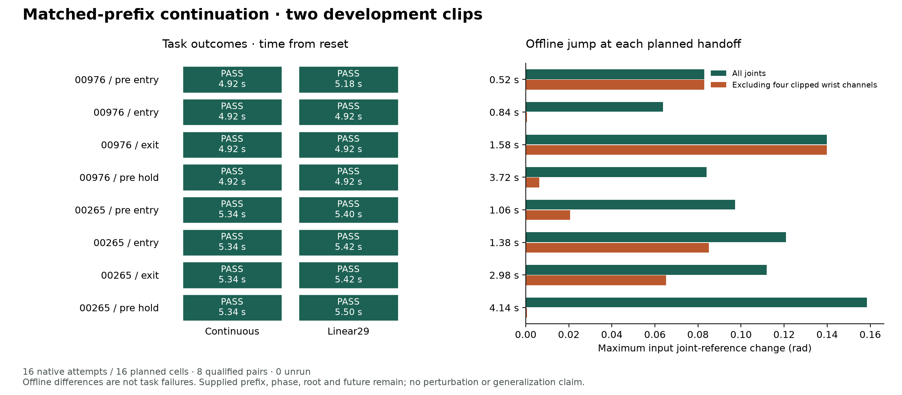

# 实际来态 continuation：continuous 与 Linear29 均为 8/8

后续独立结果：[已知地图下 public selector 的 continuous/Linear29 各 2/2](SELECTION_CODEC_RESULTS_zh.md)。下文保留本次 handoff 的原范围与账本。

2026-09-18（本地研究日期）。[原协议](CONTINUATION_PROTOCOL.md)的第二次资源 admission 已完成：**16 次 native attempts、16 个完整 episode、8 个合格配对；continuous 8/8，Linear29 8/8**。零重试、零基础设施失败、零训练。独立账本为 **4,136 control steps / 16,544 physics contact frames**，包含所有共同 prefix；旧 168-attempt 余额不变。

这是 2×3 矩阵第二行的**同相位、无扰动子面板**。实验执行真实 prefix，保留完整历史后替换参考，但仍提供正确 phase、root 和未来。它不是选择新 chunk、扰动恢复或因果 composer 的结果，也不是两种表示等价或已泛化的证明。

## 记录链与固定对照

首个 packet `runs/continuation_20260918_v1/` 因 300 s 资源等待结束，0 launch、16 unrun；[原报告](CONTINUATION_RESULTS_zh.md)、[JSON](../results/continuation.json)及所有失败/延期 receipt 保持原样。用户要求继续后，另存[admission 02 登记](CONTINUATION_ADMISSION_02.md)，执行 `runs/continuation_20260918_admission02/`。没有重新给 16 次预算，也没有覆盖旧结果。

准备前核对原 148 项绑定；新 packet 共绑定 155 项，包括父记录和 admission 源码。来源、checkpoint、参考、四个 handoff 时刻、seed、scorer、停止规则与执行源码均未改变。每次 launch 仍要求两次相隔 20 s 的资源检查通过。本次十六格全部获得 admission，且仅运行一次。

完整任务使用既有 goal050：3D goal distance ≤0.50 m、speed ≤0.10 m/s，全身越过障碍后缘至少 0.02 m，满足冻结直立条件的 15 tick recovery 后，再获得 50 tick 新 hold。50 Hz 控制、200 Hz 接触检查；禁止障碍/非脚地面力 >1 N。没有将结果事后改称 goal025。

共同 prefix 由 continuous 参考真实执行。每个 handoff 在 action k 前记录；物理状态、速度、动作及控制器历史、参考游标和随机状态在两种方法间配对。Linear29 保留先前冻结的 10 Hz、12-bit、29 关节重建与原 root，不增加 handoff anchor 或 blending；原两帧 reset anchor 早于全部 handoff，不能把当前执行的 continuous prefix 当作免费压缩数据。

## 完整任务结果

下表时间均**从 reset 起算，包含 prefix**，不是切换延迟。每格仅一次执行；同一 source 的四个状态高度相关，不能当作八个独立源或由此构造泛化成功率。

| Source / 来态 | Handoff | Continuous | Linear29 | 配对初态、prefix、来态最大误差 |
| --- | ---: | ---: | ---: | ---: |
| 00976 / pre-entry | 0.52 s | 成功 · 4.92 s | 成功 · 5.18 s | 0 |
| 00976 / entry | 0.84 s | 成功 · 4.92 s | 成功 · 4.92 s | 0 |
| 00976 / exit | 1.58 s | 成功 · 4.92 s | 成功 · 4.92 s | 0 |
| 00976 / pre-hold | 3.72 s | 成功 · 4.92 s | 成功 · 4.92 s | 0 |
| 00265 / pre-entry | 1.06 s | 成功 · 5.34 s | 成功 · 5.40 s | 0 |
| 00265 / entry | 1.38 s | 成功 · 5.34 s | 成功 · 5.42 s | 0 |
| 00265 / exit | 2.98 s | 成功 · 5.34 s | 成功 · 5.42 s | 0 |
| 00265 / pre-hold | 4.14 s | 成功 · 5.34 s | 成功 · 5.50 s | 0 |

独立读取逐帧数据复核终止与接触：全部有新 50 tick hold、所需有序恢复与全身离开；全 episode 最大记录障碍力与非脚地面力均 **0 N**，无跌倒。终止时 goal distance 为 0.1035–0.2357 m，最大末帧速度 0.0373 m/s；这些末帧数值不替代已冻结的完整时序标准。

所有 continuous prefix 与父 continuous rollout 的最大误差为 0；八个方法配对的 reset/dynamics、prefix、incoming state/history 最大误差也为 0，随机状态一致。每次 native adapter 的 continuous 重建检查误差为 0，且不消耗 RNG。由此首次获得这个 handoff hook 在本面板上的物理资格，而不仅是 CPU conversion 检查。



## 表示差异有多大，实验又排除了什么

Linear29 确实改变了 native reference：八个 handoff 的最大关节位置差为 0.0637–0.1585 rad，最大关节速度差为 0.3237–4.1466 rad/s；continuous 切换差为 0。00976 exit 的最大位置差约 0.13985 rad 来自膝关节，仍完成任务。这里是**参考变化**，不表示实体关节瞬间跳动，也不直接等于 motor action 差。

冻结 wrist range clipping 仍存在，并未为了通过当前实验重校准。当前结果只说明这些差异没有破坏这个控制器在八个已支持来态上的完整任务成功；不能说明手腕信息不重要、任意切换安全或更紧间隙也无损。Linear29 相对 continuous 的完成时间差为 0–0.26 s，只有一次执行且来源相关，不据此宣称效率优势或建立统计等价。

本实验不是端到端在线压缩传输：共同 continuous prefix、正确游标、原 root、完整未来及控制器均是辅助条件。先前[完整参考成本账本](COMPLETE_TASK_RESULTS_zh.md)继续适用其自身信息条件；不能把本面板的成功直接转成“自主任务以更低码率完成”。两份 authored clip 的更高层 ancestry 独立性未建立，没有 held-out scene、LLM 物理调用或导航学生。

## 研究决定与下一项工作

**本面板未发现 complete-task 成功上的 codec 瓶颈。保留 Linear29 强基线，下一步识别“新后续选择是否受支持”，暂不启动新 tokenizer 训练。** 这不推翻历史 RVQ/leg12 机制结果；两者任务、进入条件和指标不同。

相邻项目新完成 measured-state FK 与 native encoder/FSQ/decoder parity，但其几何请求仍只 shadow logging，尚未驱动选择。已只读核验并保存[同步与下一工作包](COMPOSER_SYNC_20260918.md)，不合并其两次物理实验到本账本。

具体顺序：先整理小型、带 q/qdot/root/双时基/support validity 的本地 primitive bank；使用测量状态、历史和场景检索/对齐候选，不由任务输入给正确 clip/phase。再登记真实选中 transition 的 continuous/Linear29 配对执行，扰动另作条件；最后去掉 supplied future，在同一因果 root planner 与 selector 下比较完整 reset episode。已有 native horizon 为 0.9 s，不能把短于它的 chunk 默默补成已知未来。未知 support、seam 或场景必须保持未知，不能成为成功标签或自动安全停止。新 native batch 需要自己的预算和固定 case 清单。

## 证据与复现

公开 [aggregate JSON](../results/continuation_admission02.json)逐 case 保存任务分数、handoff/reference 变化、全部配对审计和底层文件 hash。原始动作/接触/轨迹、参考及 checkpoint 留在本地；图仅含标量统计。

```bash
RESEARCH_PY=/home/linjiw/groot-wbc-sonic-sim-trackb/.venv_research/bin/python
# 已完成 packet 不能重跑或覆盖；新执行须新登记。
PYTHONPATH=src "$RESEARCH_PY" -m hindsight_motion.continuation_report --help
"$RESEARCH_PY" scripts/plot_continuation.py \
  --summary results/continuation_admission02.json \
  --output artifacts/continuation_admission02.png
```

受影响的 admission、continuation、完整任务与报告检查共 16 个测试通过；本次无修改冻结的 native runner、adapter 或 scorer。
