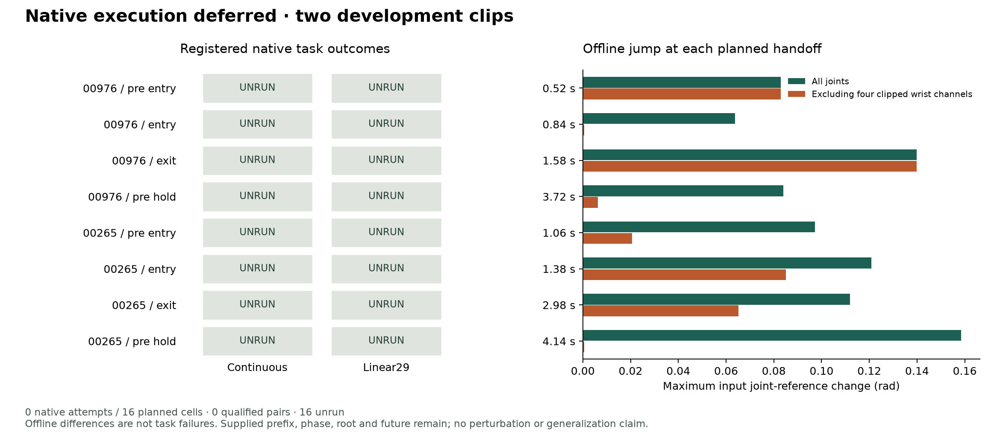

# 实际来态 continuation：实现、离线诊断与资源延期

后续：[关联 admission 02 已完成，continuous/Linear29 各 8/8](CONTINUATION_ADMISSION02_RESULTS_zh.md)。本报告保留首次 0-launch 资源延期的历史状态；下文不回填后续结果。

2026-09-18。依据执行前冻结的[协议](CONTINUATION_PROTOCOL.md)和[注册](../configs/continuation_v1.plan.json)，推进完整任务矩阵第二行的第一部分：**共同 continuous prefix 后的同相位参考切换**。

**本轮没有新的物理结果：0 native attempts、0 episodes、0 control/physics steps，16 个预定格全部 unrun。** 串行资源门槛等待 300 s 后退出，未重试，也未修改阈值。不能把 unrun 写成 0/16 物理失败。此前完整参考任务的 continuous 4/4、Linear29 4/4 仍是有效的独立记录。

## 已经完成什么

- 冻结两个既有 beam 任务 × 四个来态 × 两种表示，绑定 148 个输入/源码 hash，保存本地快照。
- 实现真实 prefix 执行后的参考切换；不通过复制 pose 伪造共同来态，也不重置控制器历史。Continuous 是恒等切换对照；Linear29 沿用原冻结解码，没有追加 handoff anchor 或平滑。
- 增加完整 prefix、来态物理状态、action/observation/controller history、动力学与 RNG 配对审计。Continuous 必须先通过旧 prefix 重放及完整任务资格；失配/基础设施失败会停止队列。
- 完成两个来源的 CPU native-library 转换检查：在离线 identity joint/body order 下，continuous 重建与 loader 数据逐字段最大误差均为 0。实际 IsaacLab 映射和运行时 hook 的资格仍需首个 native control；离线检查不替代它。
- 测试覆盖来态选取、短 prefix/非有限值、历史失配、候选未来泄漏、RNG 失配和资源延期计数。没有训练模型。

## 冻结的取样位置

| Source | Pre-entry | Entry 后 | 全身 exit 后 | 最终 hold 前 |
| --- | ---: | ---: | ---: | ---: |
| 00976 | k=26 / 0.52 s | k=42 / 0.84 s | k=79 / 1.58 s | k=186 / 3.72 s |
| 00265 | k=53 / 1.06 s | k=69 / 1.38 s | k=149 / 2.98 s | k=207 / 4.14 s |

位置只由之前 continuous 成功记录的 entry/clear/hold 时间和固定规则决定，在本轮任何候选结果出现前冻结。它们是阶段代理，不保证恰好对应开始降低或开始制动。每个 k 表示执行 k 个共同控制步后、action k 之前。两源的更高层 ancestry 独立性仍未建立，四个来态不能算作四个独立 motion。

## 新的离线观察：不能把所有切换误差归于手腕

比较同一 k 的 continuous 与 Linear29 **输入 qpos**，不使用物理成功标签：

| Source / state | 全关节最大位置变化 | 去除四个 clipped wrist 通道后的最大变化 | 前向差分速度最大变化 |
| --- | ---: | ---: | ---: |
| 00976 / pre-entry | 0.0829 rad | 0.0829 rad | 4.1466 rad/s |
| 00976 / entry | 0.0637 rad | 0.0006 rad | 3.2207 rad/s |
| 00976 / exit | 0.1398 rad | 0.1398 rad | 1.8509 rad/s |
| 00976 / pre-hold | 0.0840 rad | 0.0064 rad | 0.3256 rad/s |
| 00265 / pre-entry | 0.0973 rad | 0.0206 rad | 0.7608 rad/s |
| 00265 / entry | 0.1209 rad | 0.0851 rad | 0.4653 rad/s |
| 00265 / exit | 0.1120 rad | 0.0652 rad | 0.3237 rad/s |
| 00265 / pre-hold | 0.1585 rad | 0.0005 rad | 0.6555 rad/s |

00976 的 pre-entry 和 exit 最大位置差分别来自右膝和左膝。某些 knot 上位置接近，也可能有明显速度差。因此，后续若切换失败，需区分 wrist range clipping、低频时序重建和突然更换参考的影响。**这些数值不是实际执行的关节跳变、控制器 action 变化或失败证据**；前向差分来自输入 qpos，不冒充 native FK 导数的实测值。



## 资源与证据边界

资源规则沿用 ≥12,000 MiB free GPU、≥16,384 MiB available host，连续两次检查间隔 20 s。15 次采样中有 3 次单独达到门槛，未出现两次连续满足；最后记录约 10,958 MiB GPU、16,162 MiB host。资源不足在 launch 前被拦截；没有 native 启动失败，没有新的仿真失败。

单次执行登记保留在 `runs/continuation_20260918_v1/`：registration、plan、源码快照、execution-start、resource_wait/deferred、offline-input-diagnostics 与 aggregate 都保留。公开 [JSON](../results/continuation.json)区分 16 scheduled、16 unrun 与 0 physical attempts，并提供证据 hash。原八次 pilot、旧 168-attempt 余额及全部已有失败记录未改动。

## 下一步与研究判断

研究顺序不变：**先完成这八个 matched-state pair，之后才决定需要表示改进、seam 处理还是更高层选择实验。** 暂时没有证据把优先级改成训练 temporal codec、LLM/VLA 或新导航学生。

本 packet 已因 resource timeout 关闭；不通过删除 receipt 或反复重启绕过登记。资源可用后，应保留这次记录，新建明确关联它的 admission packet，核验冻结输入/预算后执行同一面板。现存 runner 的 native callback 尚未经物理运行资格验证，这是当前实质性未完成项。

即使将来全部通过，也只支持这些无扰动、同相位、给定未来的切换。真实新 chunk 选择、扰动恢复、root 因果规划和未知场景闭环仍是独立问题。

## 复现入口

```bash
RESEARCH_PY=/home/linjiw/groot-wbc-sonic-sim-trackb/.venv_research/bin/python
# 历史 packet 不可覆盖或重启；这些入口需配合新登记及新的输出目录。
PYTHONPATH=src "$RESEARCH_PY" -m hindsight_motion.continuation --help
PYTHONPATH=src "$RESEARCH_PY" scripts/continuation_input_diagnostics.py --help
PYTHONPATH=src "$RESEARCH_PY" -m hindsight_motion.continuation_report --help
```

序列化与输入诊断不启动 physics；runner 经资源门槛后才使用 SONIC `.venv_isaaclab`。
