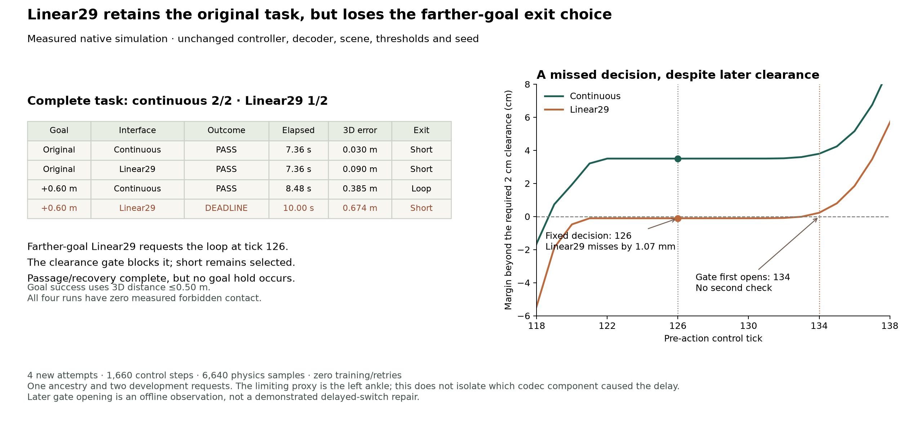

# 距离响应完整任务：continuous 2/2，Linear29 1/2

2026-09-19。[主计划](RESEARCH_PLAN_zh.md)要求先检验完整任务中的表示保持。本次[独立 admission 02](DISTANCE_CODEC_ADMISSION_02.md)完成原先从未启动的四格：**原目标两者成功；远 0.60 m 目标 continuous 成功、Linear29 超时。** 出现一个配对成功退化，没有增益；四次均无跌倒或禁用接触。原始[零启动延期记录](DISTANCE_CODEC_RESULTS_zh.md)及其汇总保持不变。本比较的四次预算已用完。

这给出了一个具体的下游缺口：Linear29 保留了请求 loop 的距离判断，却改变了身体离梁时序，使固定 tick 126 的一次性 clearance gate 拒绝该请求。之后没有复查，机器人沿 short 路线停止在远目标之外。**能跟踪、能正确表达请求、能在实际状态接受请求，是三个不同的资格。** 结果还不能识别哪一个 codec 组成部分导致了时序变化。

## 1. 四格完整结果

| 梁任务 | 表示 | 完整任务 | 时间 | 最终 3D 目标距离 | 最终速度 | 请求 / 实际出口 |
| --- | --- | --- | --- | --- | --- | --- |
| 原 goal | continuous | 成功 | 7.36 s | 0.029953 m | 0.05256 m/s | short / short |
| 原 goal | Linear29 | 成功 | 7.36 s | 0.090251 m | 0.03746 m/s | short / short |
| goal 远 0.60 m | continuous | 成功 | 8.48 s | 0.384866 m | 0.02400 m/s | loop / loop |
| goal 远 0.60 m | Linear29 | deadline | 10.00 s | 0.674383 m | 0.04146 m/s | loop / short |

四格均完成 passage/recovery；前三格达成 50 tick ordered hold，最后一格为 0。远目标 Linear29 不是撞梁或一直不能减速，而是减速到了错误的位置。四格 obstacle / nonfoot-floor 峰值接触力均为 0 N。时间是 control steps × 0.02 s，不是计算耗时。

**计量更正：冻结 scorer 用 3D root–goal 距离 ≤0.50 m，endpoint predictor 用 XY。** 早期协议把 goal radius 写成 XY 是文字错误；原 scorer、登记和结果未修改，独立复算仍完全相同。另见[更正说明](DISTANCE_METRIC_CORRECTION_20260919.md)。最终单帧距离、预测误差和最终 50 帧均值残差不能混用。

## 2. 请求保留了，执行机会却丢失了

两种表示都在内部 pre-action tick 126 选择距离请求。远目标 continuous 预测 short / loop 的 XY 终点误差为 0.61658 / 0.30067 m；Linear29 为 0.64076 / 0.27800 m。两者都请求 loop，但只有 continuous 的实测 clearance gate 打开。

事后 [FK gate 审计](../results/endpoint_codec_transfer.json)在所有四条实际历史上复算相同规则：所有身体 proxy 必须越过梁后缘至少 2 cm。tick 126 的限制 proxy 均是 `left_ankle_roll_link`：

| 表示 | 相对规定 2 cm 的余量 | 首次 pre-action gate 打开 | tick 126 决策 |
| --- | --- | --- | --- |
| continuous | +35.015 mm | 119 | 允许距离请求 |
| Linear29 | −1.069 mm | 134 | 保持 short；不再复查 |

Linear29 的 proxy 已越过梁后缘约 18.93 mm，只是没有达到 20 mm 门槛；这不是“仍在梁内”或碰撞证据，也不是降低安全阈值的理由。gate 比 continuous 晚 15 ticks（0.30 s）打开，比固定决策晚 8 ticks（0.16 s）。任务 scorer 的 post-action clear tick 为 118 / 133，与 pre-action 119 / 134 相差一帧，时序口径必须保留。

在同一种表示的两条真实自由闭环历史之间比较：continuous 的 loop choice 首次差异在 126，reference/token/action 在 127，pre-action root/joints 在 128；Linear29 的两种目标在共同的 368 tick 中，choice/reference/token/action/root/joints 全无差异。远目标的额外 132 tick 是超时前延续，不是另一条独立成功轨迹。

此前在 **continuous 历史上施加 Linear29 shadow** 会在 126 得到 goal-dependent reference。这并不与现在矛盾：真正 Linear29 访问了不同身体状态，gate 为 false。接口保真必须包含“请求—状态资格—承诺—执行—完成”的整条链。

## 3. 归因范围：先测一次性准入，不先修未来 blend

本干预固定 scene、goal、reset、motor、planner bank、root、阈值和 seed，只改变 motor 所接收的关节表示。因此这个格的退化属于当前 codec + controller 接口组合。但 frozen Linear29 同时带有量化、插值、range clipping 和速度推导；限制 proxy 在脚踝，不能据此把原因单独归给 leg channel，也不能把 wrist clipping 判为无关。

还有一个因果时序约束：决策前两者都使用 short reference，尚未发出 loop reference。之前发现的 loop blend 速度差异以及选中 loop 后的 forecast 分支差异，不能反向造成 tick 126 之前的 gate 失败。预决策 short 重建已经不同，仍可能通过全身控制产生延迟。因此，最直接的下一项是[有截止时间的 clearance 准入诊断](CLEARANCE_ADMISSION_DIAGNOSTIC_zh.md)，而非立即训练新 tokenizer 或针对未来 blend 调参。

## 4. 独立审计与成本

- 原 scientific registration、task bytes、251 项输入/源绑定全部保持；新 admission 共 278 项绑定。两项 continuous control 的 reference、proprio、token、action、root/joint/body 轨迹、动力学、接触和特征均逐项复现历史父记录，最大误差 0。
- 两对 reset/history/dynamics/RNG/初始候选成本完全一致。四项完整 scorer 独立复算一致；全部 **1,660** 个 issued references、composed indices、family/decision 精确回放。
- **4 native attempts、1,660 control steps、6,640 physics samples、85.730 s native wall time**；0 infrastructure failures、0 retries、0 未运行、0 teacher-action queries、0 training updates。没有使用历史 main 的剩余预算。gate 等待时间不计入 native wall。
- 一个 `00976` ancestry、一个 seed `96161`、熟悉 reset、两个选定 development 请求。不是独立成功概率、held-out 泛化、跨族切换或感知控制证据。两臂都保留完整 continuous planning bank、root 和 side metadata；没有测得系统存储或 wire-rate 节省。

本地 packet：`runs/distance_codec_20260919_admission02/`。公开 [measured aggregate](../results/distance_codec_admission02.json) 仅含标量、审计和哈希，原 motions、decoded arrays、checkpoints、raw trajectories 留在本地。新增 admission 代码及全套本地测试通过：74 tests。

## 5. 同步相邻项目：endpoint 校准已执行，但不解决本次 gate

本次 fetch 后本仓库与 origin 无 incoming；相邻项目本地 `eb8f1f8c` 新增独立 `ExecutedEndpointComposer`，没有改写本比较绑定的旧 controller。其旧几何动作库保持不变，两个既有 continuous 轨迹提供 executed displacement 校准。

[相邻结果快照](../results/endpoint_controller_sync.json)：beam/clear × +0.40、0.45、0.50、0.60、0.90、1.20 m，共 12 请求 × 2 controller；calibrated **12/12** 对 incumbent **11/12**，1 gain、0 regressions、11 对完整轨迹精确保留。+0.45 m beam 改为 short 后成功；+0.50 m beam 成功余量仅 **0.01658 m**（3D goal radius）。新 16 attempts / 6,280 steps / 25,120 contact frames / 625.325 s；另复用八格 3,356 steps。24 格只有五条不同 action arrays、一个来源与 reset，不是 24 个独立示范。这些 controller 结果不并入本仓库 codec 预算，旧 9/10 envelope 快照仍保留。

本仓库另做零 native、零 motor 查询、零拟合的**事后探索审计**：在原 goal 的真实 continuous/Linear29 历史上分别施加六个 calibrated goal。Linear29 在 +0.50 m 及以上仍请求 loop，但全部受原 false gate 阻止。此 shadow 不能证明 calibrated Linear29 的物理结果，只说明该历史上的 endpoint 替换没有改变 gate。

continuous 校准在原成功历史上近零残差属于熟悉轨迹保留。把同一模型放到 Linear29 已执行的 short 上，预测与最终 50 帧 root 均值的 XY 残差为原目标 **4.486 cm**、远目标 **4.598 cm**；后者的窗口不是成功 hold。这些值不是 final goal error、误差界或独立样本，不能与 1.658 cm 余量直接作同任务因果比较。它们提示以后必须把 predictor 的 controller/codec/状态适用范围写入接口。

**发布前同步补充：相邻真实 reset screen 已执行完。** 新工作树记录（capture 时 HEAD 仍为 `eb8f1f8c`，screen 尚未提交）另存[独立快照](../results/reset_controller_sync.json)：六种实际初态扰动的 beam **5/6**、clear **6/6**；两项 zero controls 精确复现旧历史。14 新 attempts / 5,619 steps / 22,476 contact frames / 578.316 s，零训练。forward −0.10 m 的 continuous beam 在 126 请求 loop 但 clearance 差 59.875 mm；138 才清空，最终 0.699989 m deadline。所有十四格无禁用接触/跌倒；forward-minus clear 和 forward-plus beam 成功余量仅 3.868 / 5.727 mm。

因此固定时刻准入的脆弱性也会由 **continuous 的实际 reset 改变**触发；本次 codec 干预暴露该接口问题，不证明问题专属于量化。这个小确定性 screen 也不建立广泛 reset 鲁棒性。两项目均应先资格验证 pending exit，再做学生训练；我们不复制它的 reset 实现或重复整个 screen，优先复用其未来已版本化的兼容 wrapper。原本归档的 calibration report 后续加了 metric/reset 链接；公开快照的旧哈希可由 `eb8f1f8c` blob 精确复原，本地同时留存原报告，不重写旧 receipt。

延迟选择还会修改已经对 motor 可见的远端 forecast。下一协议必须明确：承诺接下来五个 **control ticks**，其后视作可修订预测；这不是原一次性选择在全部新分支首次可见前完成的等价重放。相同当前帧不能保证 motor 动作相同。保持 clearance、goal、motor 与 codec 不变，另行资格验证整个新时间接口。小 LLM 分支继续次优先级：未来检查 request/pending/accepted/expired/complete 字段及真实后续执行，不能把选中 ID 当作完成任务。
