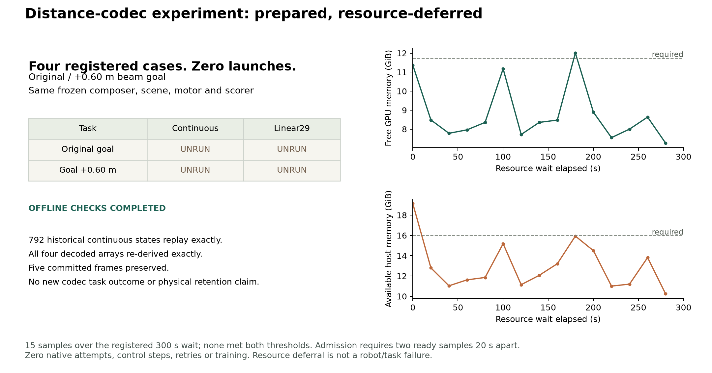

# 距离响应表示比较：已登记与预检，资源延期，四格未运行

> 后续更新（2026-09-19）：[新 admission 已完成四格](DISTANCE_CODEC_ADMISSION02_RESULTS_zh.md)，continuous 2/2、Linear29 1/2。相邻 endpoint calibration 也已独立物理执行，12/12 对 11/12。本文保留当时的延期/同步快照，不作为最新状态。goal 距离维度见[文字更正](DISTANCE_METRIC_CORRECTION_20260919.md)。

2026-09-19。用户要求继续主计划后，已实现并冻结 [original/farther beam × continuous/Linear29 四格协议](DISTANCE_CODEC_PROTOCOL.md)，完成 adapter、原始记录重放与配对配置检查。**本轮 native attempts = 0、四格全部 unrun**：串行资源 gate 的 300 s 等待结束，没有进入仿真。这不是任务失败，也没有产生新的 Linear29 完整任务成功率。

| 注册任务 | Continuous | Linear29 |
| --- | --- | --- |
| 原 beam goal | 未运行 | 未运行 |
| Beam goal +0.60 m | 未运行 | 未运行 |

## 已完成、可以复核的工作

- 复用相邻固定 `DistanceExitComposer`，只在输出到 motor 前按注册替换 q/qdot。Continuous 保留 supplied analytic blend velocity；Linear29 保留原先的 position-FD convention、两帧 reset anchors、named scale 与 wrist clipping，没有静默修正边界或增加 sidecar。
- 从连续数组重新编码 nominal/local_duck × short/loop 四项，与原离线 packet 的 decoded q/qdot **逐项完全相同**。两条分支的五帧 commitment 精确一致，synthetic observed-support masks 没有被提升。
- **792 个既有 continuous state** 精确重建：original-beam 368、farther-beam 424。Issued reference、composed indices、family、loop choice 与 measured-clearance decision 全部相同。这些是既有记录的重放，不是 792 次新执行或新的独立样本。
- 两个 method pair 的 task JSON 字节完全相同；非输出路径/representation_method 的 config 字段完全相同。原/远 goal 使用同一场景文件与障碍字节。Native 后的初态/history/dynamics/RNG 和实际完整任务仍须运行后审计，不能以配置相同替代实际测量。
- 准备 packet 绑定 **251 项**输入、源码、weights、task、命令和注册文件；保留完整 source snapshot、protocol-before-execution 与独立 queue receipt。本地 **72 tests passed**，含 committed-frame 拒绝、composed-clock terminal padding、root/support 保持及 continuous supplied velocity 保持。

另用[独立 packing 检查](../scripts/check_distance_adapter.py)将新 native treatment helper 与先前冻结的 shadow 路径逐帧比较：同一 792 个 continuous-history state 上，Linear29 的 float640 references 完全相同，零 motor-action query。检查保存在本地 `adapter-check.json`，仍不构成新仿真或实际 codec trajectory。

控制器依旧保留 full continuous bank、root、geometry/support 与 fixed clock；输入 motor 仍为 float640。逻辑 joint payload 不能被描述为实际系统压缩。既有 preflight 中的 q/qdot branch 边界前移和早一个 tick 的 goal-response 仍是已声明的处理效应；本轮未获得其闭环作用。

## 为什么没有启动

要求同时满足 GPU free ≥12,000 MiB、host available ≥16,384 MiB，并连续两次采样合格，间隔 20 s。注册的 300 s 内共 15 次采样，**没有一次同时满足两项**。GPU free 范围 7,437–12,295 MiB；host available 为 10,481.23–19,581.41 MiB。两项的各自最大值不在同一时刻，不能用它们推断资源够用。

零 launch、零 control/physics steps、零 retry、零 teacher-action query 或训练；四次 native 预算尚未消耗。Queue 已按规则关闭，原 `execution-start.json` 与 `resource_deferred.json` 保留。不能在同一 packet 自动重启等待或覆盖 receipt。

本地 packet：`runs/distance_codec_20260919_v1/`；[状态与审计摘要](../results/distance_codec.json)、[资源采样与相邻结果快照](../results/distance_followup.json)。源动作、decoded descendants、原始轨迹与 checkpoint 保持本地。

## 同步后研究方向的更新

本轮开始前相邻已更新到 `7b416f76`。其**另一项连续控制实验**发现 public exit selection 9/10、short-only 5/10，五个 paired gains 与一个 +0.45 m beam regression；补齐了缺失的同 scene +0.60 m short-only 对照，并取得 nominal-loop support。其十四次新 native attempt **不记入本仓库**。详见[同步与研究判断](DISTANCE_ENVELOPE_SYNC_20260919_zh.md)。

因此当前有两个清晰问题：**表示是否保留可执行的距离选择；停止位置预测是否足以选择正确的 exit。** 前者仍需本四格物理比较；后者已有独立的 controller boundary failure。相邻提出的 executed-loop endpoint 校准目前只是事后离线假设，不能写成 calibrated controller 10/10。我们不为迎合这个新结果更改已冻结的四格原始 predictor。

下一动作是在资源可用后，为这四个 **never-launched** case 建立单独 admission，先重新核对原输入/源码/注册与零 launch 记录，再保持 task、预算、method 顺序和停止规则运行。总 native ceiling 仍为四次；保留本次延期历史。届时先复现两个 continuous controls、匹配两对实际初态/history/RNG，再独立审计各自访问状态上的 gate、choice、通过/恢复/停止与 first goal-dependent reference/action/state。

若两者通过，继续冻结简单表示，后续优先关注停止余量、endpoint-model 兼容性及来态覆盖；若仅 codec 失败，再登记 velocity 或 forecast boundary 对照。没有新证据支持扩大 tokenizer、训练学生或让 LLM 直接进入物理控制。LLM/BFM/VLA 接口仍需返回 measured progress 与 termination，保真 sidecar 不会修复错误的停止预测。
