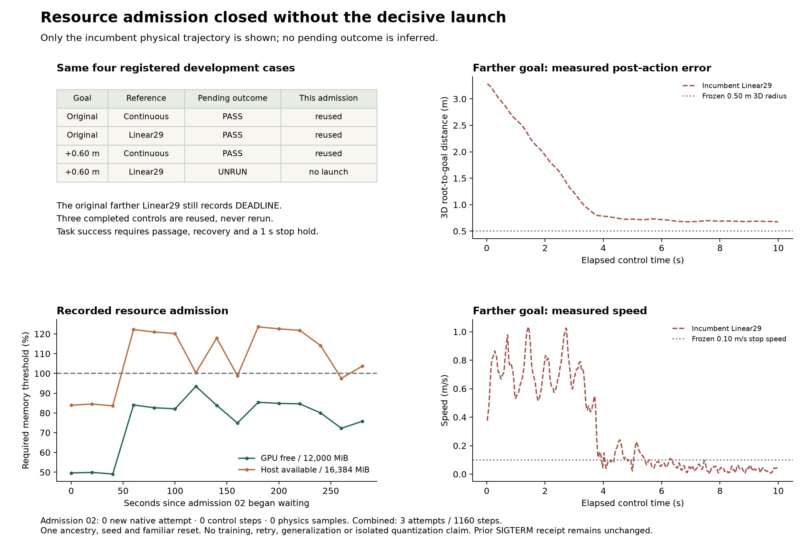

# Pending exit admission 02：资源延期，关键格仍未运行

2026-09-20。按[主计划](RESEARCH_PLAN_zh.md)只补唯一 never-launched 的 `farther-beam_linear29`，预先保存[协议](PENDING_EXIT_ADMISSION_02.md)及[机器登记](../configs/pending_exit_admission_02.plan.json)。**本次 300 s 资源门槛正常超时，零 native launch；不能提供 delayed-loop 的新物理结论。** 原三个成功控制直接复用，四次总预算仍只使用三次。

## 已完成的工作与冻结条件

新增独立 admission 工具，拒绝重跑已启动 case、替换失败 attempt、扩大控制/物理帧或 retry 预算，以及改写父 packet。验证原 **363** 项输入/源码绑定，加入三条成功控制的完整历史及资格记录、原 plan/registration、前次 SIGTERM 中断、此次实现/协议/命令后，共 **428** 项绑定。准备及关闭后的校验均一致。新旧 task 文件字节相同，config 只改 task/output 路径，command 只替换输出目录；pending controller、motor、codec、原 predictor、scene、seed/reset/RNG、2 cm gate、162 截止、3D goal050 与 scorer 全不变。

本次没有采用相邻的 calibrated predictor 或 167 窗口，也没有重跑三项 controls。代码验证 **92 tests passed**。计划中的实际 delayed-transition 边界审计已准备但未执行，保存在本地 packet；未发布为完成证据。

## 资源证据与成本

| 项目 | Admission 01（保留） | Admission 02（本次） |
| --- | --- | --- |
| queue 结束 | SIGTERM / 143，sender 未知 | 正常 300 s resource timeout，进程 exit 0 |
| 最后一格资源采样 | 15；1 次合格，未连续两次 | 15；0 次合格 |
| 新 native attempts | 3 | **0** |
| 新 control / physics samples | 1,160 / 4,640 | **0 / 0** |
| 关键 farther Linear29 | 未启动 | **仍未启动** |
| native process failures / retries / training | 0 / 0 / 0 | **0 / 0 / 0** |

本次记录的 GPU free 范围 **5,892–11,218 MiB**，最高仍低于 **12,000 MiB**；host available 为 **13,701–20,250.512 MiB**，要求 **16,384 MiB**。登记要求两次连续合格、间隔 20 s，未形成任何合格样本。首末采样相差 **280.183 s**，这与 runner 最后再等待 20 s 后写入的 **300 s** timeout 一致；不要将首末采样跨度当作完整 wait 时间。

本次存在原 runner 写出的 `resource_deferred.json`，没有 launch/exit；前次只有事后记录的 SIGTERM 关闭收据。两类关闭原因不能合并。新 packet `runs/pending_exit_20260920_admission02/` 已关闭，不再次调用其 run 入口；原 `runs/pending_exit_20260920_v1/`、失败基线及所有旧公开 JSON 均保留。

## 完整比较仍有哪些空缺

| Task / representation | 原 one-time gate | Pending gate | 本次证据来源 |
| --- | --- | --- | --- |
| 原 goal / continuous | 成功 | 成功，7.36 s / 0.029953 m | 复用 admission 01 |
| 原 goal / Linear29 | 成功 | 成功，7.36 s / 0.090251 m | 复用 admission 01 |
| 远 goal / continuous | 成功 | 成功，8.48 s / 0.384866 m | 复用 admission 01 |
| 远 goal / Linear29 | Deadline / 0.674383 m | **未运行** | 无新物理结果 |

以上距离均为最终 **3D** root-goal distance。三个 controls 无需 delayed acceptance，成功且精确保留旧轨迹仅证明 wrapper retention。旧 Linear29-history shadow 在 134 接受、+0.70 s 开始改变 q/qdot forecast，仍是 imposed-state replay，不能推断 motor action、状态、接触或完整成功。合并账本继续为 **3 native attempts / 1,160 steps / 4,640 physics samples / 94.625 s native wall**，不能把复用控制重复计数。

图中 goal error 和 speed 曲线只有**旧 incumbent 的实际轨迹**；没有绘制或外推 pending 新轨迹。其停止速度较小但 goal distance 仍超界，提醒完整 task 不能用低速度或无碰撞代理。

## 相邻项目的新结果与当前研究判断

只读同步到相邻 **`2a3cfb47`**，无 incoming pull；其 committed continuous pending test 已在 backward reset 上成功，接受 138、424 ticks、最终 3D 距离 0.290882 m。另一个 early supplied-loop control 也成功；两次共 848 steps 属于独立预算。详见[来源与对比](PENDING_CONTROLLER_SYNC_20260920_zh.md)。这加强了共享时间接口值得测的动机，但原 predictor / Linear29 / deadline 162 的关键比较仍必须由本仓库自己的运行回答。

主目标仍是保留可执行选择、完成 traversal/recovery/stop，再评价动作表示。现有证据不支持增加 tokenizer 复杂度；也不支持将 gate timing 的系统效应归结为量化机制。LLM 的字段保持测试继续是独立次分支，不能替代物理任务资格。

## 下一动作：资源可用后再做一次独立 admission

先只读检查共享资源是否可用，避免不断为明显不足的资源登记等待。资源确有可用窗口后，为同一 never-launched case 另建 admission 03，绑定两个关闭 packet、三个已完成控制、428 项冻结绑定及本次资源收据。仍最多 **1 native attempt / 500 ticks / 2,000 physics samples / 600 s wall / 300 s wait**，零 retry，总四次 ceiling 不扩展。不能重开本次队列、释放其他任务的内存、降低 gate 或重复 controls。

若实际 delayed Linear29 成功，下一项是 controller/codec 兼容的完整 episode inventory 与小规模因果学习协议，保留 continuous 强基线、按完整 episode/reset/goal/祖先分组，明确 outcome-only failures 和 public behavior targets。若接受后失败，先定位 continuation/stop 阶段；若超出合法窗口，记录 unsupported。无论哪种情况，都先完成此决定性比较，才登记新执行/学习，而非用更多离线分析代替它。

可复查的[合并结果](../results/pending_exit_admission02.json)、[本次资源收据](../results/pending_exit_admission02_queue.json)、[原部分结果](PENDING_EXIT_RESULTS_zh.md)相互分离。当前有一个具体资源阻塞，无新物理研究结论。
