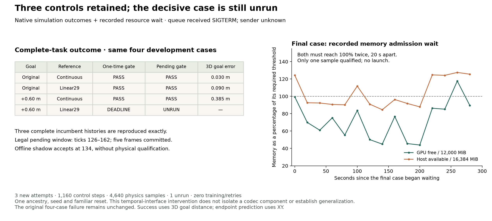

# Pending exit：三项控制精确保留，关键一格尚未运行

2026-09-20。接续[主计划](RESEARCH_PLAN_zh.md)的 complete-task 优先级与[9 月 19 日失败诊断](DISTANCE_CODEC_ADMISSION02_RESULTS_zh.md)。本轮依据用户继续指令，单独登记[四格协议](PENDING_EXIT_PROTOCOL.md)，保留旧四格和原远目标 Linear29 的真实失败。**三个已运行控制均成功且完整轨迹精确保留；关键的 farther-beam Linear29 尚未启动。** queue 在最后的资源等待期间收到 SIGTERM（exit 143），sender 未知。没有正常 resource-timeout receipt，不能把它改称正常超时或第四次物理失败。当前尚无延迟准入修复的物理证据。

## 冻结的问题与接口

原 controller 在 tick 126 正确请求 loop，但 Linear29 的实测全身 clearance 未达到梁后缘外 2 cm，后续不再复查。现在锁存原请求，仅在合法共同前缀窗口内等待同一 gate。保持原 endpoint predictor、motor、codec、scene/task bytes、reset/history/dynamics/RNG、root、速度规则及所有成功阈值。没有采用相邻 calibrated predictor，也没有强制 loop。

逐字段比较两种 family 的 short/loop 原始数组及 decoded arrays：continuous 首次分支差在 172；Linear29 q 首差 168、qdot 首差 167。支撑 proposal/observed/validity、root、rotation、bounds、foot 特征与 donor index/family/synthetic bridge 全部纳入。短路线缺省的 donor 字段以直接源映射解释，不改变原 motion；第一次准备在此 schema 差异处拒绝，尚未创建实验 packet、零 native attempt，开发失败记录保留在 `runs/pending_exit_development_20260920/`。

五个 dense control frames 要求 `tick+4<167`，两种表示共享最晚准入 **162**；163 尚未接受则 expired，保持 short。当前到 +0.08 s 的 dense 帧不改，但其后的 native horizon 是可修订预测。晚选择可以改变此前 motor 已见的 future sample；不是旧 full-preview 时序的等价重放。当前 pose 相同不保证 action 相同。

## 离线资格与实现范围

wrapper 关闭时，旧四格全部 **1,660** 个 state/reference/index/decision 精确回放。开启后，两个 continuous 和原目标 Linear29 的 reference 全部保留；远目标 Linear29 在固定旧历史上预测 **134** 接受 loop，reference 从 134 开始变化。这个 shadow 不包含新的 motor action 或物理后续。

实验 packet：`runs/pending_exit_20260920_v1/`，冻结 **363** 项输入/源码/历史记录绑定。新实现是独立 `PendingExitComposer`/native adapter 与 request lifecycle；原 controller、codec、scorer、资源门槛和数据未修改。全套本地测试 **83 passed**，包括截止当刻、截止后、永不清空、short/disabled、request 锁存、clock gap、非有限值及 donor/support 前缀拒绝。

请求时间、pending 原因/实测 margin、accepted/expired 时间、实际 route、任务完成分开。legacy `distance-exit.json` 仍记录原 126 决策；后续准入在 `pending-exit.json` 与 per-tick choice 中，不把 `requested` 或旧 `chosen` 误当最终执行分支。

## 三格物理结果与一格未运行

| Goal | 表示 | 旧一次 gate | 新 pending 接口 | 新实测时间 / 最终 3D 距离 | 与旧完整轨迹 |
| --- | --- | --- | --- | --- | --- |
| 原 goal | continuous | 成功 | 成功 | 7.36 s / 0.029953 m | 精确相同 |
| 原 goal | Linear29 | 成功 | 成功 | 7.36 s / 0.090251 m | 精确相同 |
| 远 0.60 m | continuous | 成功 | 成功 | 8.48 s / 0.384866 m | 精确相同 |
| 远 0.60 m | Linear29 | deadline | **未运行** | 无新物理记录 | 待测 |

三个控制无需真正等待 gate：原目标请求 short，远目标 continuous 在 126 当刻接受 loop。因此结果只建立新 wrapper 的原有行为保留，**没有测到发生延迟接受后的执行**。三项全身通过、恢复和 50 tick hold 均成功，无跌倒或禁用接触。全部 **1,160** 个新 reference/composed indices/lifecycle 独立回放一致，任务 scorer 复算一致；三条完整 state/action/contact 轨迹逐项对旧记录最大误差 0。已运行的原目标 method pair 初态/历史/动力学/RNG 一致；远目标 Linear29 未运行，不能说两个新 method pairs 都完成了配对审计。

## 资源与中断：保留明确的失败类别

本轮 **3 native attempts、1,160 control steps、4,640 physics frames、94.625 s native wall**；0 native process failures、0 retries、0 training、0 teacher-action queries。另有 **1 次 queue process interruption**，不计为第四个 native attempt。原四格继续作为独立复用控制，未改写或重算预算。新四次 ceiling 已用三次，剩余最多一次；历史 main 余额不动。

最后一格资源账本有 **15 个采样**，覆盖首末间 **280.203 s**；仅一次同时满足 GPU ≥12,000 MiB / host ≥16,384 MiB，下一次又不满足，从未形成 20 s 间隔的两次连续合格。queue supervisor 返回 **143/SIGTERM**，未留下 `resource_deferred.json`，也不存在该格 launch/exit；检查未发现剩余 runner/native 进程。`queue-interruption.json` 与 `stopped.json` 是随后根据这些记录补写的观察性关闭收据，明确 sender 未知，未伪造原 runner 的正常超时事件。记录见[物理结果](../results/pending_exit.json)及[中断/资源账本](../results/pending_exit_queue.json)。

## 额外离线 packing 核对

最后一格的旧历史上，134 接受后的 shadow 与旧 short reference 具有完全相同的五个 committed dense frames。经官方 `unpack_reference` 还原真实物理采样后，q/qdot 差异仅出现在 horizon 样本 7、8、9（composed 169/174/179，最早 **+0.70 s**）；rotation 差异在样本 8、9（最早 +0.80 s）。SONIC 的 640D block 不是物理帧，不能直接 reshape 来解释时间。这个事后零 native/零 motor-query [shadow 审计](../results/pending_exit_queue.json)验证预测修改的位置，不提供新的动作、接触或任务结果。

## 下一动作：只补唯一 never-launched case

为 `farther-beam_linear29` 做独立 admission，绑定当前中断、三条完成记录、363 项冻结输入以及原 registration/plan/commitment；保留旧 packet 和公开部分结果。新目录只允许这一格，**最多 1 attempt / 500 ticks / 2,000 physics samples / 600 s native wall / 300 s resource wait，零 retries/训练**，跨 admissions 总 ceiling 仍为四次。复用已经合格的 farther continuous 作为配对 entry/RNG 对照，不能为了方便重新执行三个 controls。资源 gate、predictor、codec、task/scorer 和窗口 162 全不变。

后续若拿到该格，才检验是否 pending→accepted→完整成功，以及首个 reference/action/state 差异是否发生在实际接受之后；实际 delayed loop 的边界审计仍待结果。若又遇资源不足，继续保留 unrun；不得放低 gate 或把离线 loop 当成功。研究方向不变：先完成这一个决定性因果比较，再考虑 decoded-loop 支持、endpoint compatibility、reset 范围或新表示。小 LLM 继续独立次分支。

## 数据与结论边界

完整 scorer 的 goal radius 是 **3D** 0.50 m；预测误差才是 XY。一个来源祖先、一个 seed、一个熟悉 reset、两项 development 请求。三个无延迟控制的成功不支持 pending repair、泛化、量化机制、压缩收益或语言执行。Licensed motions、decoded arrays、模型与 raw trajectories 全留在本地。

相邻项目已提交 `9e7d5c3e`，真实 reset screen 的既有 5/6 beam、6/6 clear 与毫米级停止余量未变；pending controller 在本轮同步时仍为拟议，故这里实现独立 wrapper 并不改其工作树。本仓库及相邻 origin 都没有 incoming，未覆盖相邻已有未提交工作。
