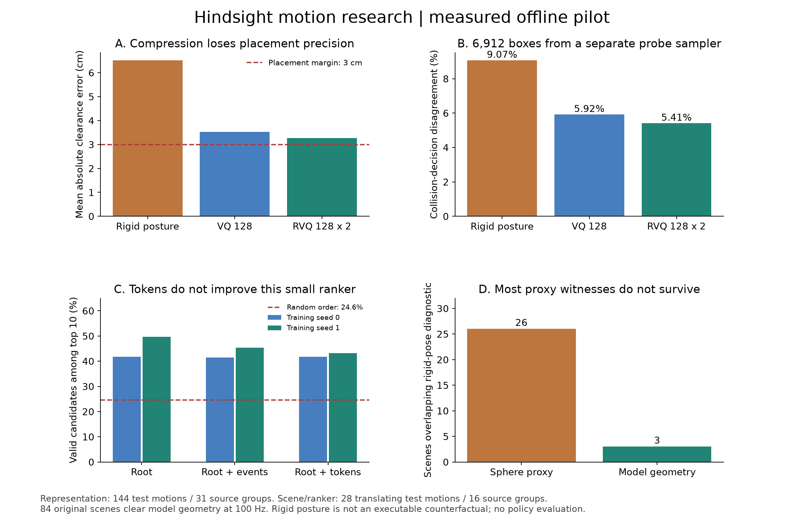

# 第一轮实际实验结果

日期：2026-09-15。工程位置：`/home/linjiw/hindsight-motion-research`。

**结论：本机数据已跑通 motion → token / event → 障碍候选 → 小模型评分 → 模型碰撞核验的离线链路。当前结果支持保留连续身体几何；尚不支持 motion token 提高场景提案质量或提升闭环导航的结论。**

## 1. 做了什么

| 内容 | 已完成的实际工作 |
| --- | --- |
| 动作输入 | 900 条本地 G1 重定向动作，14 个来源目录类别，共约 2.930 小时原始序列 |
| 来源划分 | 201 个来源目录组；训练 632 动作/140 组，开发 124/30，测试 144/31 |
| 时间窗口 | 每条取最多 4 秒、50 Hz；按预先写明的位移规则选择窗口；保留起止帧 |
| Motion token | 5 帧 × 29 关节角一个块；训练 128 码字 VQ 与两层 RVQ；最多 20,000 个训练块 |
| 事件 | 导出 6,872 段确定性运动学事件，包含骨盆、躯干、手脚等数值信息 |
| 场景生成 | 398 条位移 ≥0.6 m 的动作，每条 64 个候选，共 25,472 个候选；每条最多保留 3 个，共 1,194 个 |
| 小模型 | 约 7.85 万参数 MLP；root、root+事件、root+token 三组，每组 2 个种子，各训练 400 步 |
| 精细复核 | 全部 84 个导出的测试场景，用 MuJoCo 碰撞几何、100 Hz 采样重新检查 |
| 实现校验 | 8 项针对碰撞边界、全时间段检查、平移不变性、量化和四元数插值的测试通过 |

分组规则和各轮配置在对应 `*PROTOCOL.md` 中先于运行写下。数据来自已经被其他本地研究使用过的库，因此这是一轮**探索性留出实验**，不包装成全新确认性基准。按来源目录分组仍不能排除未记录的跨目录同一人物/动作重复。

旧有 `/home/linjiw/motion2scene`、`motion2scene-training` 项目与训练记录保留原样。本轮新结果来自实际本地 mocap 重定向库，没有把旧合成 motion 场景或旧策略分数当成新实验结果。

## 2. Token 保留了多少身体避障信息？

在相同的连续 root 世界位置与完整朝向下，改变关节动作表示。每个测试动作独立采样 48 个障碍探针；共 **144 动作、31 来源组、6,912 个 motion–box 检查**。探针采样器独立于 hindsight 场景提案器；同一来源的观测仍存在相关性。

| 表示 | link 原点平均位置误差 | 障碍最小间距 MAE | 碰撞判断不一致率 | false-safe / 原动作代理碰撞数 |
| --- | ---: | ---: | ---: | ---: |
| 完整连续动作 | 0（参照） | 0（参照） | 0（参照） | 0 / 2,588 |
| 同 root、固定关节姿态 | 8.66 cm | 6.52 cm | 9.07% | 536 / 2,588 |
| 单层 VQ，128 码字 | 5.31 cm | 3.53 cm | 5.92% | 185 / 2,588 |
| 两层 RVQ，各 128 码字 | 4.62 cm | 3.26 cm | 5.41% | 109 / 2,588 |

这里的身体位置误差是 30 个 **link 原点**的平均欧氏距离，不是人体关节重建或机器人网格表面误差。碰撞判断基于模型碰撞形状的外包球；false-safe 指压缩后判断不碰撞、原动作的外包球实际上与探针相交。

按来源组 bootstrap 1,000 次，RVQ 的间距 MAE 95% 区间约为 **[2.96, 3.63] cm**，碰撞判断不一致率约 **[4.43%, 6.64%]**。统计量是按动作加权的均值，区间重采样单位是来源组。

**解释：** 两层 RVQ 相比这个固定姿态基线保留更多信息，但当前压缩误差与 3 cm 放置余量同量级。不能只凭动作播放“看起来接近”就让 token 重建替代精确几何。

本轮不是神经 VQ-VAE、MoMask 或 MotionGPT 的复现。它也不是严格的整条动作压缩率比较：root 连续旁路没有被压缩。完整几何旁路若恢复原判定属于信息保留的设计效果，不能作为同信息预算下的学习收益。

## 3. 场景是否确实需要全身动作？

### 粗几何层

398 条符合位移阈值的动作均能从 64 个候选中找到至少 3 个满足原动作外包球 3 cm 余量的场景。导出 1,194 个场景，使用低块、柱体或有支撑的横梁门架。

这项通过率不代表生成场景自然、有功能或可执行：随机把物体放在路线旁也能通过。位移阈值还会接收体育、跳跃等动作。**398 是有位移的候选窗口数，不是已验证的导航动作数。**

测试部分只有 **28 条动作/16 来源组**，共 1,792 个候选、84 个导出场景。在这个候选池中：

- 随机顺序 + 全身外包球过滤：84 个通过，其中 7 个让固定姿态外包球发生重叠。
- 全身过滤 + 按固定姿态重叠优先排序：84 个通过，其中 26 个固定姿态重叠。
- 仅固定姿态过滤：84 个选择中，72 个满足原动作 3 cm 余量，8 个与原动作外包球发生碰撞，另 4 个没有碰撞但余量不足。

26 对 7 的差异是按该指标排序得到的选择结果，不是学到了人类避障动机或导航收益的证据。更关键的是下一项复核。

### 模型碰撞几何层：26 个见证只剩 3 个

将全部 84 个导出测试场景加入固定 G1 模型，直接查询 MuJoCo 碰撞几何；原 50 Hz 采样之间增加四元数 SLERP/关节线性插值的中间帧，得到 100 Hz 采样。

| 检查 | 实际结果 |
| --- | ---: |
| 原动作发生环境碰撞 | **0 / 84 场景** |
| 原动作保持至少 3 cm 模型几何间距 | **84 / 84** |
| 所有场景中的原动作最小间距 | **3.41 cm** |
| 固定姿态外包球重叠 | **26 / 84** |
| 固定姿态在模型碰撞几何下仍重叠 | **3 / 84，来自 2 条动作** |

约 88.5% 的代理“固定姿态会撞”见证在更精细的检查后消失。外包球会把形状之间的空隙也占据掉，因此适合保守排除原动作碰撞，却不能可靠地证明替代姿态必然碰撞。

剩下的见证包括 `CMU/108` 和 `HUMAN4D/Subject4_Carine` 的动作；后者文件名带篮球语义。这进一步说明几何筛选不能自动转化为平地导航示范。

**这 3 个仍然只是运动学见证。** 固定姿态对照沿着 root 移动，却没有正常步态，尚未验证其本身能够执行。因此目前没有一个样本被宣布通过“可执行反事实”资格。

MuJoCo 使用自己的碰撞表示，包含网格凸近似；100 Hz 采样也不能证明帧间连续无碰撞。本轮不检查完整动态稳定性、脚接触有效性或闭环跟踪误差。

## 4. 小模型读 token，是否比只看 root 更好？

本轮训练的是 **候选场景评分器**：先由确定性采样器生成 64 个场景，再由模型排序，最后使用共同几何验证器。它还不是自由输出任意物体坐标的语言模型。

root 基线包含稀疏路径、root 高度、完整朝向、路径长度和候选场景几何。事件模型增加四个时间区间的身体部位统计；token 模型增加四个时间区间的两层码频率。三组使用同一零填充输入宽度、64/64 隐层、训练样本、步数和对应随机种子。所有归一化参数只由训练组计算。实际有效特征数量不同，不宣称覆盖所有模型设计的公平最优比较。

评价“每条动作前 10 个场景提案有多少满足全身几何余量”，测试 28 条动作/16 来源组；包括没有成功候选的情况。当前候选池的总体有效比例为 26.34%。

| 提案排序方法 | 种子 0：前十有效率 | 种子 1：前十有效率 |
| --- | ---: | ---: |
| 随机候选顺序 | 24.64% | 同一个固定候选池 |
| root + 场景几何 | **41.79%** | **49.64%** |
| root + 事件 + 场景几何 | 41.43% | 45.36% |
| root + token + 场景几何 | 41.79% | 43.21% |
| 知道全部几何标签的 oracle 上限 | 97.50% | 同一个固定候选池 |

所有训练模型在前十查询中均能为 28/28 条动作找到至少一个有效候选；随机顺序为 26/28。这是**几何查询效率**，不是导航成功率。测试中没有整组无有效候选或全部候选有效的动作。

token 对 root 的配对差异：种子 0 为 **0.00 个百分点**（来源组 bootstrap 95% 区间约 −1.54 至 +2.63）；种子 1 为 **−6.43 个百分点**（约 −10.00 至 −1.43）。区间条件于训练种子，不代表两个种子充分刻画了训练不确定性。

**解释：当前小模型有助于从候选池找到几何可行场景，但 token 没有带来稳定额外收益。** 这不能证明所有 motion token 或语言模型都无效；它说明必须先解决表示、标签与功能目标的质量。小模型仍需几何过滤，分类概率不是安全证书。

## 5. 已交付的文件

| 内容 | 文件 |
| --- | --- |
| 数据库存、token 选择与当前官方资料 | [DATASETS_zh.md](DATASETS_zh.md) |
| 后续严格实验设计和判定标准 | [RESEARCH_PLAN_zh.md](RESEARCH_PLAN_zh.md) |
| 原始逐动作指标、输入哈希与分组 | `runs/pilot_20260915_v1/` |
| 码本、6,872 个事件、1,194 个场景 | 上述目录中的 `codebook.npz`、`events.jsonl`、`scenes.jsonl` |
| 六个真实训练完成的小模型与预测 | `runs/proposer_20260915_v1/` |
| 84 场景模型几何逐条复核 | `runs/geometry_20260915_v1/` |
| 可导出的科学图 | [PNG](../artifacts/pilot_summary.png)、[PDF](../artifacts/pilot_summary.pdf) |
| 原动作、固定姿态和 VQ 的交互回放 | [viewer.html](../artifacts/viewer.html) |
| 运行命令 | [README](../README.md) |

源动作保持本地，导出场景保存源路径/哈希及时间窗，而不是复制原始人体数据到发布包。代码、模型和所有本轮评估结果已经落盘。

## 6. 下一阶段最值得做什么

**先完成可执行动作配对和障碍干预实验。** 优先找 root 条件相近但收臂、侧身或摆腿不同的动作；原动作和替代动作先通过空场景执行，再做“障碍存在/移除”的四格验证。与此同时，用模型几何修正代理见证的假阳性。

有了这批数据，才能可信地比较 token/事件/连续全身表示的价值，再用固定低层 tracker 做独立 scene-first 测试的高层导航学习。当前报告没有宣称已提升导航策略、复原真实环境或证明动作原本因障碍产生。
