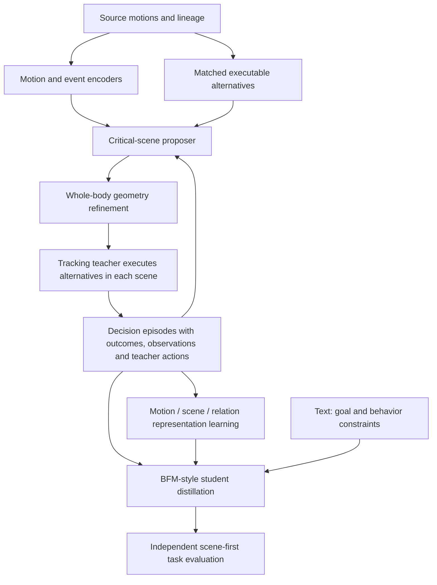

# Research roadmap: critical scenes → motion/scene representations → BFM → text-to-navigation

> Latest execution: [decoded-motion physics and source acquisition](DECODER_EXECUTION_zh.md). Linear29 preserves all six frozen arm/beam intervention panels on two existing KIT/205 pairs; continuous controls preserve all six. RVQ variants fail 54/54 preflights; three additional source groups fail 24/24. Cumulative 248 preflight and 216 main episodes. Keep the 96 representation descendants separate from the 120-episode acquisition dataset. Next priorities: isolate temporal discontinuities versus leg reconstruction, establish more teacher-supported carriers, then evaluate proposer and student utility on independent scenes.

> Follow-up completed: a second traversal family now passes all three intervention panels. Cumulative main episodes: 120. See [new results and token comparison](SECOND_FAMILY_AND_TOKENS_zh.md). The earlier counts below describe their original experiment stage.

> Latest execution: 96 main scene episodes across four edited pairs and three source groups; two arm pairs fully replicate, one is partial, and ducking has no qualified full panel. See [expanded results](EXPANSION_RESULTS_zh.md). Prior milestones below retain their original planning context.

> Execution update (2026-09-15): the first arm-tuck stage is complete—48 teacher preflight episodes, 24 physical interventions, and three verified matched panels from one motion pair. The tokenizer diagnostic loses critical clearance margins. See [results](CRITICAL_RESULTS_zh.md) and [native protocol](CRITICAL_EXPERIMENT.md). The full multi-family study and BFM/text2nav stages remain open.

Prepared 2026-09-15 in response to the clarified project goal. This document is a proposed next-stage plan; no new physics, tokenizer training, or policy training was performed while writing it. Completed measurements remain in `RESULTS_zh.md`.

## 1. The research objective

Build a scene proposer that identifies **where an obstacle makes a particular motion adjustment useful**, preserves the executable motion, and produces motion–scene pairs that improve subsequent humanoid navigation/traversal learning. Develop representations of these pairs that support a behavior foundation model and, later, grounded language instructions.

The central object is a **decision episode**, not an isolated obstacle or a motion caption:

> From this measured entry state, toward this goal, the obstacle makes this body adjustment useful; when the constraint changes, another executable adjustment becomes appropriate.

The first publishable contribution can be the critical-scene data engine and its measured utility to a fixed downstream learner. A larger BFM and text-to-navigation are compatible extensions, but their success is not a prerequisite for testing whether the scene engine supplies useful information.

## 2. What the pilot tells us to change

- The 26 → 3 reduction in rigid-posture collision witnesses means proxy penetration cannot be the positive functional label. Use bounding geometry to reject unsafe candidates cheaply; use model collision geometry and achieved executions for the final label.
- The current small model learns geometric admissibility. Admissibility alone rewards irrelevant obstacles that happen to be out of the way. Add a separately measured **behavioral relevance** target.
- Current VQ/RVQ codes compress joint-angle blocks and leave the root uncompressed. They are useful baselines, but not language-aligned motion representations or motor-controller latents.
- Root+token did not outperform root consistently in a two-seed ranking pilot. The next test must contain real behavior choices where the extra body information can matter; increasing model size on the same weak labels is not yet motivated.
- Movement screening admitted sports/jumping clips. Introduce locomotion/traversal eligibility and teacher execution coverage before expanding the generated dataset.

## 3. The full loop

The feedback to the proposer uses measured execution evidence. The tracking teacher supplies motor expertise. A qualified continuation selector or planner supplies task-level choices; a tracker alone does not supply both.

## 4. Milestone A — a small dataset of verified behavior choices

### A1. Freeze the teacher contract and establish its envelope

Assume a promising tracking teacher is available. Pin the checkpoint, decoder, robot collision assets, joint order, action scale, PD gains, physics/control timesteps, history layout and normalization. First test selected nominal motions in an empty environment and selected transitions from a common entry state.

Measure root/body tracking errors, foot sliding, support contacts, falls and stopping/terminal behavior. Calibrate placement margins to the **achieved** motion distribution and model discrepancy; an arbitrary 3 cm reference margin is not sufficient. A teacher can be excellent on walking and still lack ducking or narrow-passage capability. Family-specific coverage determines which families enter the first study.

First consider arm tuck, side-facing passage, ducking and low-step traversal; use only two families that the teacher can execute reliably for the first packet. Avoid hand support, climbing, object manipulation or intentional obstacle contact in this initial task definition.

### A2. Retrieve or construct executable alternatives

For each target behavior, retrieve a plausible simpler alternative, or create it with constrained editing/optimization and requalify it in empty space. Neither fixed joints nor an unvalidated straight-line shortcut is an admissible physical alternative.

Match start, goal, progression and nuisance factors. **Do not match away the mechanism:**

| Behavior tested | Match as closely as possible | Allow to differ |
| --- | --- | --- |
| Arm tuck | Root xyz/orientation, leg progression, speed | Arm configuration and reach |
| Side-facing passage | Root xy progression, start/goal, speed | Pelvis/torso heading needed to reduce width |
| Ducking | Root xy, progression and goal | Pelvis/head height and relevant joint motion |
| Step-over | Start/goal, forward progress, appropriate support phase | Swing-foot clearance and associated leg motion |
| Route detour, later | Start/goal and task constraints | Root path and resulting timing |

This corrects an over-restrictive interpretation of the previous plan: matching root height for all ducking pairs or root orientation for all side-turn pairs would remove the behavior under investigation. Use a stronger root baseline to measure how much of each family's result root information already explains. Arm pairs with matched root are especially valuable for isolating extra body information.

Use a shared entry state and an executable common approach where possible. If two motions begin in different poses, qualify entry transitions; do not attribute an initial-state difference to the obstacle intervention. Preserve several acceptable alternatives where available rather than selecting one artificially weak comparator.

### A3. Generate and intervene on scenes

Initialize candidates in the region occupied by an executable alternative but avoided by the target. Search supported primitive shapes with continuous position/orientation/size refinement. Check the entire passage, approach, exit and required stopping interval, not only the event's peak frame.

Each paired decision gets four scene conditions:

1. **Critical:** proposed obstacle constrains the alternative while the target remains usable.
2. **Relaxed:** widen/lift/reduce the relevant obstacle enough to change the choice, when the geometry permits it.
3. **Removed:** remove the constraining obstacle; both motions should remain executable.
4. **Displaced:** move a comparable obstacle away from the decisive region, then verify the claimed irrelevance rather than assuming it.

Execute both motion continuations under the same task scorer and paired initial perturbations. Store failures and uncertainty. For the first bounded packet, target 20 motion pairs across two supported families, up to 4 scene conditions × 2 continuations × 3 paired perturbation seeds = **480 rollout attempts**. This is an engineering pilot budget, not an assertion of statistical power or 20 guaranteed qualified pairs. Empty-scene trials are part of the removed condition; failed qualification trials still count in the attempt ledger. Stop after the declared attempts and assess coverage before a larger study.

The target need not be the unique globally optimal behavior. It should have a demonstrable advantage over relevant feasible alternatives under the scene condition. If an equally simple alternative succeeds, retain that as a multiple-solution scene or lower the strength of the criticality label.

### A4. Define “critical” using intervention outcomes

Let `J(behavior, scene)` be a registered traversal cost evaluated on the achieved rollout. Treat safety/goal failures explicitly; analyze successful traversal cost separately or declare any failure penalty before fitting. A useful difference-in-differences diagnostic is:

`U(S) = [J(alternative,S) − J(target,S)] − [J(alternative,removed) − J(target,removed)]`.

Report its underlying success/contact outcomes, not only the scalar. Positive U indicates that this constructed obstacle increases the target's relative usefulness under the tested alternatives. It does not identify the original human's motivation.

Per obstacle, record the body part, candidate contact interval, decision lead time, successful/failing dimension range, and the effect of removing that obstacle. Fit a range of valid placements instead of one knife-edge coordinate. For multi-object scenes, measure leave-one-out and selected joint removals because two obstacles can be redundant or jointly necessary.

**Milestone output:** a source-grouped set of decision episodes, an outcome matrix for every attempted pair, robust parameter intervals and genuine null/multiple-solution cases. Progress is measured by qualified choices and coverage, not total obstacle count.

## 5. Milestone B — train a critical-scene generator/proposer

### Model interface

`p_theta(S, event, body_part | motion, goal, robot_geometry)`.

The first useful model can be a temporal event encoder and an autoregressive head that emits:

`[event index, obstacle type, relative position, orientation, dimensions, stop/no-scene]`.

Keep metric values continuous initially. Use a mixture density or several proposals when one motion admits multiple placements. Sample in an event-relative frame, retain the transform to world coordinates, and preserve a route/global context stream. A local model must not block another part of the motion later.

Use a shared encoder with task-family heads as an initial implementation. A small Transformer is a reasonable candidate once temporally aligned labels exist; compare it with a tuned temporal MLP/CNN and a nonlearned geometric optimizer. The architectural choice is secondary to whether the candidate support and supervision include useful scenes.

### Training signals and sampling

Separate heads/targets for:

- reference and achieved-motion admissibility;
- intervention-based behavioral relevance;
- execution robustness over perturbations;
- sparse, supported, plausible scene structure;
- uncertainty and no-scene/reject decisions.

A proposal score can combine these targets, but physical and geometry validity remain explicit checks. Do not fit a single “good scene” label that hides different failure reasons. More diverse negative data include reference collision, executable but irrelevant obstacles, proxy-only relevance, invalid physical alternatives, and unseen/out-of-support inputs. Unmeasured outcomes remain unknown rather than negative.

Report raw proposal distributions before filtering and accepted distributions after filtering. Use active acquisition to choose candidates near uncertain decision boundaries and candidates that distinguish models; retain a randomized acquisition branch with a logged sampling law to audit selection bias.

### Decisive evaluation

Compare random placement + common filtering, root-conditioned generation, full-body geometry optimization, full continuous motion input, and token/event-conditioned proposal. Match geometry-query and execution budgets. Report verified critical pairs per 100 proposals, queries per accepted pair, source coverage, diversity, abstention and failure modes.

Test source-motion groups and separately authored scene families that did not participate in fitting or repeated pilot inspection. Include shuffled event order/body-part inputs and an oracle-label bound. Improvements only on the generator's own ranking labels do not establish dataset utility.

## 6. Milestone C — representations useful to both scene generation and BFM

Use three connected representations and a separate motor interface. “Token” need not mean an integer at every layer.

| Representation | Content | Primary use |
| --- | --- | --- |
| Motion tokens | Temporally ordered reconstructable body/trajectory features | Motion compression, event understanding, proposer conditioning, future-behavior targets |
| Scene tokens | Metric geometry, object type/pose/size, observation state | Current scene conditioning and scene generation |
| Motion–scene relation tokens/labels | Body part, critical interval, clearance/obstruction change, supported behavior alternatives | Training supervision, retrieval and behavior-choice alignment |
| Motor latent/action targets | Tokens consumed by the frozen controller decoder, or correctly scaled teacher actions | Actual student control |

**Mocap VQ IDs are not SONIC motor tokens.** Learn a verified adapter through teacher execution or predict the native motor latent directly. Pin the decoder and token schema; changing the teacher can invalidate latent targets even when dimensions match.

### C1. Improve the motion tokenizer

Preserve temporal order; the pilot's four-bin code histograms lose within-bin sequence order. Compare learned temporal VQ/RVQ with continuous embeddings at matched rate/capacity. Factorization into root, torso/pelvis, arms and legs is a hypothesis to test, not a required shared vocabulary.

Train reconstruction of motion and velocity, key body surfaces, foot-contact estimates and clearance against independently sampled **training** probes. Test on frozen probe sets and qualified action-choice pairs. Measure false-safe/false-blocked decisions, surface clearance errors, action-choice separability, code rate and continuous-sidecar cost. Body-link MPJPE alone is insufficient.

### C2. Represent scenes in 3D

Start with object/set tokens containing shape, position, orientation and dimensions, plus exact collision geometry for verification. A single-valued heightmap cannot encode both floor and overhead clearance at the same xy location. Add sparse 3D occupancy/depth or point tokens for sensor students later.

Distinguish padding, known empty space and unobserved space. Scene tokens at deployment derive from the available map or causal sensor history; they do not contain the generator's hidden target-motion ID, critical event annotation or future collision time.

### C3. Learn useful relations, not source fingerprints

Use geometry reconstruction, motion–scene compatibility and verified behavior-choice ranking before language alignment. Train with multiple scenes per motion, multiple valid motions per scene, and obstacle interventions that reverse behavior preference. Randomize irrelevant background independently.

Relation labels from future reference motion belong in the training target/posterior view. If the deployed student predicts relations from current observations, those predictions must be generated causally and tested under their own errors.

MotionGPT supports motion-language discrete-token modeling, but does not establish that our codes preserve traversal geometry or can drive a robot. The proposed token/geometry/control interfaces are new engineering choices for this project. [MotionGPT](https://arxiv.org/abs/2306.14795).

## 7. Milestone D — BFM-style student with a ready tracking teacher

### D1. Expert = continuation selection + tracking

The tracking teacher receives a reference and produces motor actions. Initially, the task expert can be a registry of **qualified continuations for exact bound scene/goal requests**. This is sufficient for a finite training dataset. A planner/retrieval system with validated transitions expands that coverage later.

At student-visited states, the task expert must choose a compatible continuation and query the tracker from that actual state with consistent history and reference alignment. An open-loop label from the original demonstration is not a same-state teacher label. If recovery cannot be supported, exclude the query from positive recovery imitation and retain its coverage/failure record.

### D2. A direct context-conditioned student is the primary branch

Public inputs: measured robot history, scene observations, goal/terminal requirements, and explicitly available optional controls or text.

`z_t ~ p_phi(z | history, scene, goal, optional controls, availability masks)`

`motor_token_t = A_phi(z_t, history)`

`action_t = frozen_decoder(motor_token_t, history)`.

A training-only posterior may additionally observe future reference and privileged simulator state. It guides learning but is absent from the exported policy. Keep a hierarchical variant—context predicts short motion tokens/references, tracker executes them—as a diagnostic comparator, not a prerequisite that forces every design through an extra planner.

The BFM paper motivates masked online distillation and a conditional variational model; our known-map navigation interface and frozen-SONIC motor path are local adaptations. A deterministic masked imitation model is an essential simpler baseline. [BFM](https://arxiv.org/abs/2509.13780), [HOVER](https://arxiv.org/abs/2410.21229).

### D3. Training order

1. **Motor retention:** verify full/partial command behavior using actual teacher actions and a fixed decoder.
2. **Scene/goal behavior:** introduce executed decision episodes and a deployment-matched goal+scene profile with no future reference. Retain motor rehearsal data and report retention separately.
3. **Same-state online distillation:** acquire teacher actions and, when valid, recoveries at student-visited states. Record actual executed action, teacher query state and transition separately.
4. **Task refinement:** after the interface and imitation baseline work, consider bounded RL or residual adaptation for genuine task failures.

Availability masks should reflect meaningful control profiles. Hiding an instruction is not the same as instructing zero velocity; hiding obstacles changes observability and cannot be treated as known empty space. When public inputs allow several valid behaviors, use coherent behavior modes, sequence likelihood or task objectives rather than forcing one arbitrary reference via squared action error.

A useful starting loss has admitted-target action imitation, compatible motor-token imitation, posterior/prior regularization and motor-retention terms, plus optional verified relation/future targets. Each loss needs its own evidence mask and denominator. Geometric examples can train representations; they do not acquire executed-action supervision by being placed beside a scene.

### D4. Reuse existing local interfaces

Under `/home/linjiw/motion2scene-training/vendor/sonic/gear_sonic/research/scene_distillation/`:

| Existing module inspected | Reuse and required extension |
| --- | --- |
| `context_token.py` / `ContextTokenFoundation` | Existing context-conditioned prior/posterior and frozen decoder path; add tested representation adapters and supported episode views |
| `observations.py` | Known-map primitive scene encoding; enforce full-dimension conversion from our half-extent boxes and the registered robot/world frame conventions |
| `scene_teacher.py` / `QualifiedSceneRegistry` | Explicitly binds teacher, task and executed continuation; use for the first finite task expert |
| `scene_qualification.py` | Existing achieved-motion/contact/goal scoring interface; version and calibrate thresholds rather than assuming old values fit new motions |
| `collect.py`, `online_motor.py`, navigation query modules | Candidate same-state label/rollout integration points; verify history, clocks and runtime behavior before claiming compatibility |

Code presence is not proof that these modules have already been integrated with the new mocap bank or that any current checkpoint is ready for the selected tasks. The bridge requires an explicit model/joint/frame/action contract and native runtime tests.

Store canonical chronological episodes with separate `actor_view`, `teacher_view` and `target_view`. Preserve all attempts and independent support fields for geometry, motor execution, scene compatibility, task success and recovery. Derive training masks instead of deleting failed time steps and accidentally joining nonadjacent frames.

## 8. Milestone E — text-to-navigation

First show reliable goal+scene traversal with the student. Then add language as a grounded task interface: goal identification, behavior constraints and optional route preferences. For the first language study, object identifiers and goals can come from a known semantic map; unknown-object visual grounding is a separate extension.

Example:

> “Go to the doorway, pass under the beam, and stop beyond it.”

The text encoder provides intent/constraints; current scene and robot state determine the beam position, actual clearance and motor behavior. The student replans from observations as it moves. A prerecorded text-generated motion played through a tracker is not sufficient evidence for text-to-navigation.

Pair several paraphrases with the same task, the same instruction with different layouts, and different instructions with the same layout. Do not train a mapping where each sentence uniquely identifies one source clip. Begin with grounded templates; add richer text only when the schema and task outcomes are stable.

Evaluate unseen paraphrases, novel instruction compositions, altered layouts, removed/relocated obstacles, and changing goals. Measure goal/instruction completion, prohibited contacts, falls, timeouts, path/effort cost and motor retention. Evaluate arbitrary acceptable task solutions rather than requiring exact reproduction of a hidden mocap reference.

## 9. Final utility experiment: does the data engine help?

Freeze the downstream learner, teacher/backend, training steps, sensor contract and primary success scorer. Compare:

1. Motion with goal relabeling only.
2. Random geometrically admissible scenes.
3. Root-conditioned hindsight scenes.
4. Verified full-body critical scenes.
5. A scene-first expert-data baseline.

Report both matched-example and matched-acquisition-cost comparisons where possible. Gains may come from more teacher computation, more useful decision diversity, or a changed curriculum; disclose those resources.

Primary tests sample scene/start/goal **before** choosing any motion. Include task families and dimensions not tuned during proposal fitting, as well as environment interventions. Bootstrap at scene/source-group level and separate training-seed variability. Count collisions, falls, timeouts and rejected/unsupported tasks with explicit denominators.

Supportable success statement:

> Under a fixed learner and teacher budget, the verified critical-scene dataset produces more useful behavior choices and improves whole-body task completion on independently constructed scenes.

Whether this statement is true remains to be measured.

## 10. The immediate next packet

**Next deliverable: `critical_decisions_v1`, plus the BFM episode/token interface.**

1. Inventory teacher checkpoints and choose one fixed backend for qualification; verify its runtime contract with the new G1 bank.
2. Audit source ancestry and retrieve candidate pairs in two teacher-supported families.
3. Export common-entry motion pairs, primitive-scene sweeps and the four-condition intervention tasks.
4. Execute the bounded 20-pair/480-attempt maximum pilot with all failures retained; inspect true behavior-relevance support.
5. Freeze actor/teacher/target schemas, scene/motion/motor token identities and training masks.
6. Train a criticality-aware proposer only on supported targets; use geometric/unknown examples for their appropriate auxiliary objectives.

The representation and dataset interfaces can be developed while execution qualification proceeds. Scaling the generator, BFM navigation training and text grounding depend on the evidence they require; they need not be collapsed into one monolithic experiment.
