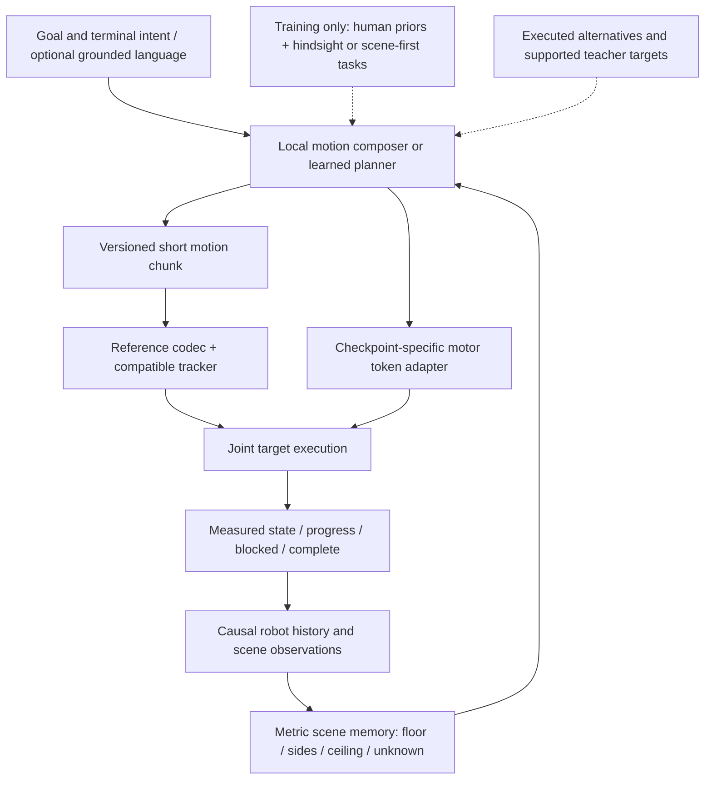

# Research roadmap: motion interfaces for complete humanoid traversal

Revised September 18, 2026. This replaces the ordering of proposed work in the [earlier roadmap](https://github.com/linjiw/hindsight-motion-research/blob/fc85b01082c703fa31b3c7776152677adbee7c3b/docs/ROADMAP_SCENE_BFM_TEXT2NAV.md). Completed protocols, thresholds and receipts are unchanged. This review launched no training or native experiments. The follow-up adds a separately registered, synthetic CPU-only LLM interface probe; its outcomes are not physical evidence.

[Research plan (中文)](RESEARCH_PLAN_zh.md) · [Literature reassessment](LITERATURE_REASSESSMENT_20260918_zh.md) · [Proposed interface](MOTION_INTERFACE_V2.md) · [Repository/evidence sync](REVIEW_SYNC_20260918.md) · [Interactive atlas](https://linjiw.github.io/hindsight-motion-research/)

## Decision and research question

Keep the goal: robust, generalizable whole-body traversal from a destination, causal observations and robot feedback, with an interface that can later serve BFM, VLA and language agents. Change the order: establish a complete task and a strong executable interface before scaling a scene proposer or a new discrete tokenizer.

**Does a short motion representation preserve executable choices from the same actual incoming state, and improve complete unseen-scene tasks at fixed causal observations, data, controller and compute?**

Null hypothesis: continuous/native motion is already sufficient; task support, root planning, switching or selection is the bottleneck. Adopted guidance and the next 2×3 physical matrix are recorded in [the review response](RESEARCH_GUIDANCE_20260918_zh.md).

A continuous chunk, a controller-native latent and a discrete code with residuals are competing answers. A new codebook is not the goal itself. The strongest current asset is the diagnostic evidence showing that geometric fidelity and executable gait can disagree. A task-relevant learned representation and downstream benefit remain hypotheses.

Recent PASSAGE, TANGO, SceneBot and SONIC work substantially overlaps the broad pipeline. Our potential contribution must be demonstrated decision preservation, robust interface behavior or acquisition/learning efficiency relative to strong alternatives. The literature review distinguishes paper observations from our design inferences; it does not establish an uncontested novelty gap.

## Current evidence, with its scope

| Evidence | What it warrants |
| --- | --- |
| Five edited acquisition pairs, three source groups; three pairs pass every panel | Local arm and duck/bend intervention evidence; only two groups support fully replicated pairs |
| Latest body9 and smoothing: 0/18; leg12: 15/18; Linear29: 16/18; continuous: 18/18 | A tested leg-reconstruction intervention improves this assisted reference path |
| Leg12 and fresh continuous each preserve six selected arm/beam panels | Representation retention on two existing KIT/205 pairs, not new independent acquisition |
| CMU/107 original/tuck: 0/145 admitted portals | No scene meets the fixed geometry gate; no new obstacle execution |
| 440 recorded preflights, 312 main episodes, 144 additional infrastructure slots without episodes | Development evidence; main = 120 acquisition + 192 representation repeats |
| No navigation student trained in this repository | No local downstream tokenizer, BFM, sensor or language improvement claim |

Full evidence: [mechanism](TOKEN_MECHANISM_RESULTS_zh.md), [acquisition](CARRIER_SCENE_RESULTS_zh.md), [decoder](DECODER_EXECUTION_zh.md), [canonical pairs](SECOND_FAMILY_AND_TOKENS_zh.md). Do not combine sibling-project controller results with these counts.

## One downstream task, two useful execution routes

First task: approach, duck under a beam, clear the entire body, recover upright, reach the goal and sustain a stop. A narrow arm passage adds a diagnostic where root information cannot explain all body clearance. Register the terminal requirements separately: historical scores measure moving arrival and do not already include this task.

Start with the inspectable reference route, retaining Linear29 and continuous controls. Compare the native 64D SONIC motor path; it may avoid an unnecessary second codec. A later direct action policy or adapted perceptive tracker remains possible if the frozen motor's supported envelope limits the task. Freezing is an experimental control, not a permanent rule for the final robot.

These routes do not assume a shared vocabulary. Compatibility requires an explicit contract for frames, joints, rates, history, decoder identity, contact intent, masks and measured completion. See [MOTION_INTERFACE_V2.md](MOTION_INTERFACE_V2.md).

## Why the current data engine needs a narrower role

The four-condition panel proves a local relationship between an obstacle and two executable alternatives. It does not prove a scene-conditioned learner is necessary: a conservative crouch-through-transit policy with recovery and stopping near the goal might solve every available scene. Use this stronger baseline, plus geometric rules based on the full body envelope, obstacle trailing edge and latency margin, and measure meaningful, predeclared cost differences where both succeed.

Human motion supplies useful coordination priors, not unique original scenes or intentions. Hindsight scenes supply hypotheses and interventions. Scene-first tasks supply an independent test distribution. All three are useful; no single generator should define both training success and the evaluation universe.

The fixed-wide CMU follow-up remains a bounded, separately registered acquisition branch. Its resource wait expired without a launch. It is neither automatically resumed by this review nor a prerequisite for all representation work.

## Work packages and decisions

| Package | Deliverable and minimal comparison | Decision gate |
| --- | --- | --- |
| P0 — interface audit | Inventory existing root/reference/motor contracts, ancestry and actual supported commands; distinguish codec bits from decoder floats | Lossless serialization/frame/history parity before physical adapter qualification; no assumed checkpoint portability |
| P1 — complete task baseline | Continuous × Linear29 across full-reference reset, matched-state suffix, and causal-composer reset conditions; native parity separately | Freeze beam position/height/length/speed distribution and full-body exit/recovery/stop scoring; all new physical cells unrun |
| P0-L — small LLM probe | Local Qwen3-0.6B vs deterministic rules; full-record relay vs ID plus lossless sidecar | Synthetic interface tests only; semantic selection and exact retention scored separately; 1.7B comparison proposed |
| P2 — representation test | Incoming-state-conditioned joint whole-body continuous latent first; equal-budget adaptive scalar/spline and same-architecture reconstruction controls; quantize only after useful gains | Preserve execution, switching and decision outcomes at disclosed total information and latency cost |
| P3 — fixed learner utility | Compare the two strongest output representations with the same learner/data/backend; separately compare acquisition methods | Held-out scene gains, retained clear-task behavior and uncertainty across scene groups and training seeds |
| P4 — sensed context | Replace known map with causal depth/LiDAR and memory while retaining action semantics | Sensor-only complete rollouts, including ceiling occlusion, latency and localization error |
| P5 — language, routes, contact | Ground language into the same goal/constraint API; route/subgoal memory; later intentional support contacts | New instruction/layout combinations, blocked-route response and separately qualified contact capabilities |

No new native budget is granted here. The historical ceiling has 168/480 main attempts remaining. Reusing any of it requires an applicable registration and serial resource gate; a new training campaign requires a new budget. Do not turn a remaining ceiling into a target sample count.

## Representation experiment contract

Distinguish three evaluations:

1. **Full-reference task support:** known-correct complete reference from reset, under the new task profile. Historical assisted codec replay remains separate evidence.
2. **Switching and recovery:** replan or change chunks from measured incoming state/history, including altered speed and body phase. Smooth joint interpolation alone does not establish valid support transfer.
3. **Causal composition:** the same composer generates root goals and selects/replans chunks from reset; compare representations before requiring a learned planner. No hidden future root or original entry segment. A later causal learner replaces the composer.

Horizontal comparisons isolate representation within a condition; vertical differences diagnose system gaps with different information/state conditions. Matched snapshots include physics, velocity, support, controller/action histories and random state. Sample reachable rollout states, then separately report each method’s own rollouts.

Report total rate, rate per stream, model size, token count, horizon and inference latency. Current body9+leg12 saves 820 bit/s versus Linear29: 23.6% of joint payload, but only 5.6% including the common root channel. Original entry/model/container costs remain additional. A codec need not win every metric, but the tradeoff must be useful downstream.

Use identical anchoring, frame conversion, velocity derivation and prefix handling across methods. Controller-response error is a local diagnostic, not a task guarantee; do not assume an exported ONNX/simulation path is differentiable. Compare geometry-rank preservation (ActionPiece) with execution-aware objectives. Learning objectives may include joint velocity, support-foot reconstruction, body clearance, temporal boundaries, supported native-action consistency and verified decision labels. These are hypotheses. Factorized body codes need synchronized coordination; part-wise reconstruction can hide incompatible combinations. Oracle original legs and future-derived labels retain their privileged status.

Do not call a float-vector motor interface an unquantized model without checking its encoder/quantizer. The current recorder captures 64 floating-point decoder inputs; SONIC's published design uses FSQ. Dimensional agreement alone does not establish identical normalization, levels or checkpoint semantics.

## Acquisition and evaluation contract

The data comparison should include simple feasible placement, root-conditioned hindsight, full-body executed contrast and a scene-first plan/edit/track-style expert. Use the same source bank and fixed learner for a controlled study; charge all geometry, simulation and filtering costs. An operational comparison with larger pretrained systems has different resources and must be labeled separately.

Split before deriving mirrored clips, retargets, scene variants or captions. Current directory grouping needs ancestry validation. Existing inspected pairs remain development. Hold out whole scene layouts and, when claimed, source performances, incoming states, obstacle combinations and sensor conditions. Fit preprocessing and rate calibration on training only.

First claim scene generalization conditional on a fixed qualified motion bank/controller; unseen-motion ancestry is a separate stronger claim. Report the whole predetermined test distribution, support coverage and unrun cases alongside retention conditional on continuous-supported cases.

Primary metric: complete task success under the versioned contact/recovery/terminal contract. Report contacts by body, falls, timeouts, blocked/rejected requests, clearance, successful-task time and paired regressions. Do not force autonomous behavior to match a hidden reference. Confidence intervals must reflect independent scene/source clusters; optimizer variation is separate. Size a main study after a feasibility/variance pilot rather than treating any universal trial count as adequate.

Teacher labels must be queried at the actual learner state with consistent history and compatible execution. Keep supported imitation, relation evidence and negative task outcomes separate. If multiple continuations work, preserve modes; averaging conflicting motor targets may invent an invalid action.

## When to change direction

If continuous references fail, improve task support or the tracker before a codec search. If execution works but selection fails, inspect observability, memory and planner coverage. If a learned codec only improves offline metrics, keep Linear29/native tokens. If verified hindsight offers no fixed-budget gain, keep the simpler acquisition method. If the fixed motor cannot execute a qualified task-aware reference, compare a separately adapted executor.

The practical next result should connect a representation choice to a complete, observable traversal decision. Vision and language remain extensions of that contract, rather than reasons to enlarge an unvalidated tokenizer.

## Small-model compatibility without changing the main question

The [LLM protocol](LLM_INTERFACE_PROTOCOL_zh.md) separates L0 synthetic contract handling, L1 real-motion information retention, and L2 matched-state physical utility. The [first result](LLM_INTERFACE_RESULTS_zh.md) is an interface failure diagnostic, not a tokenizer/control validation. A lossless sidecar can protect numbers while the model still chooses the wrong action. Keep non-language baselines and charge prompt/output tokens, all side channels and latency. Future motion-token learning needs actual alignment and free-running evaluation; zero-shot arbitrary IDs do not provide it.
