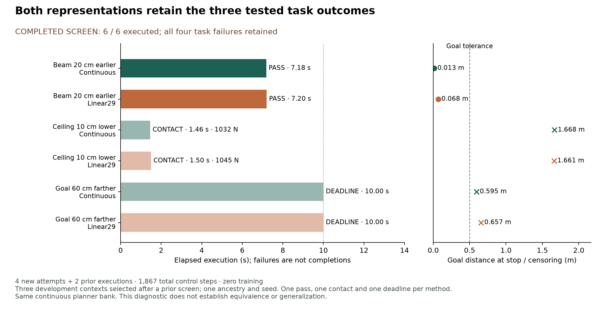

# 六格完整任务比较完成：两种表示保留相同成功与失败类型

2026-09-19。用户要求继续[研究计划](RESEARCH_PLAN_zh.md)后，通过[独立 admission 02](SELECTION_BOUNDARY_ADMISSION_02.md)执行了原先四个 never-launched case。**新增四次全部完成，六格 screen 现在无 unrun：continuous 1/3、Linear29 1/3；每种表示各一次成功、一次接触、一次超时。** 旧 shifted-beam 两格只引用原记录，没有重跑。原[部分结果](SELECTION_BOUNDARY_RESULTS_zh.md)及资源延期账本不改写。

## 结果与失败的位置

| 场景 | Continuous | Linear29 | 完整任务解释 |
| --- | --- | --- | --- |
| 梁前移 20 cm（沿用 admission 01） | 成功，359 ticks / 7.18 s | 成功，360 ticks / 7.20 s | 全身离开、恢复直立、新 50 tick hold；禁止接触 0 N |
| 梁降低 10 cm（本轮） | 接触，73 ticks / 1.46 s | 接触，75 ticks / 1.50 s | 全身通过和恢复均未完成；障碍峰值力 1,032.193 / 1,045.075 N |
| Goal 延长 60 cm（本轮） | 超时，500 ticks / 10.00 s | 超时，500 ticks / 10.00 s | 两者均无接触、完成通过及恢复，但在目标范围外停止；ordered hold 都为 0 |

更远 goal 的终点距离为 **0.595195 / 0.657425 m**，均超过冻结的 0.50 m 容差；末速度 0.044998 / 0.040692 m/s，已经低于停止速度阈值。因此失败不是“没有减速”，而是没有在要求的位置完成停止。两者全身离开 tick 为 119 / 120，恢复 tick 都是 308。这里距离沿用冻结 scorer 的三维 goal-distance 定义，不与相邻新报告中的 XY error 混用。

接触 run 的 1.46/1.50 s 是终止时间，不是完成时间；超时行的终点量是 deadline 下的测量。没有跌倒或非脚地面接触。任务失败全部留在分母内，没有因为 continuous 失败就跳过 Linear29。

## 能说明什么

三对 task-success gain = 0、regression = 0；在本 screen 的 continuous 成功子集上，Linear29 保留 1/1。两表示在低梁与远 goal 上共同失败，支持优先检查库覆盖和 goal-responsive exit/stop，而不是把所有问题归给 codec。**这不证明两种表示等价、支持边界完全相同或表示细节不重要。** 它们的终点、速度、接触时刻和力并不相同；一个 seed、一个 ancestry、三个根据先前结果选定的 development 场景不支持泛化结论。

旧选择器的[719-state goal-only 离线诊断](../results/selection_boundary_goal.json)仍保留：原 goal 与 +0.60 m goal 没有 reference 响应。这是旧 controller 的共同历史结果。相邻项目已经实现了不同的 distance-exit controller；不能把旧诊断扩展为新控制器也不响应。

## 可审计的连续性与成本

开始时本仓库与远端同步于 `4b47348bf9328dde115d7c403ac9d7ef56bb6bb8`；相邻本地更新至 `8b90ccaa`。原 293 项输入/源码绑定全部未变。新 admission 绑定 324 项，复制相同 task 字节，只搬迁 config/command 的运行输出路径；teacher/motor/checkpoints、seed、尺度、根参考、完整 continuous planner bank、decoder 和 scorer 均冻结。

两个新 continuous controls 的 reference、proprio、token、action、body/root/joint trajectories、dynamics、contacts 与原相邻 controls **逐项最大误差为 0**。两组新 continuous/Linear29 的 reset、历史、动力学、RNG、初始候选和成本也完全一致。后续访问不同状态是闭环处理效应，不是假称每帧来自同一个状态。

四个物理 score 从 recorded body envelopes 与四个 substep contact 独立精确复算；**1,148 个新 state 的 reference、候选、committed source indices 和计数全部精确重建**。连同旧两格共 1,867 个 state。未来观测、reference 与 source-label 的角色没有改动。

- 本轮：**4 attempts、1,148 control steps、4,592 physics samples，96.0404 s native process wall**；零 process failure/retry、teacher-action query、训练。
- 两次 admission 合计：**6 attempts、1,867 control steps、7,468 physics samples，162.6619 s native wall**；六次预算用完，无 unrun。第一轮的 300 s 资源延期仍单独保留。
- [累计 aggregate](../results/selection_boundary_admission02.json)为每行标明 admission，并分别记录新增与累计成本；[旧 aggregate](../results/selection_boundary.json)仍是当时两次执行/四格 unrun 的历史快照。

本地 packet：`runs/selection_boundary_20260919_admission02/`。原始 motion/decoded arrays、逐帧轨迹和 checkpoint 不发布；公开 scalar 与 hash。两种方法都保留完整 continuous bank，native 接口仍传 640D float，本轮不建立实际系统压缩收益。

## 下一步：在真正会改变退出行为的控制器上比较表示

相邻 `8b90ccaa` 已完成 distance-exit pilot：四个 prescribed support controls 与四个 public selections 都通过，其中 farther-beam 选择一次额外步行后完成；这是新 controller package，不能冒充本轮旧选择器的修复或同场景 causal gain。其 floor 字节已在原/远 goal 间固定，但缺少该场景下的 short-only farther-beam 对照。原程序仍有更广距离 envelope 待测；不为我们扩大 learner scope。

本轮已经继续完成[新接口离线审计](DISTANCE_CODEC_PREFLIGHT_zh.md)：1,528 个相邻 public-history state 的 continuous reference/index/choice 精确重放。Linear29 在同历史下保留 goal-dependent 分支差异，但其 spline 前缀与 blend qdot 存在需要提前声明的接口差别；尚未执行该新 controller 的 Linear29。

下一主实验拟议 **original/farther beam × continuous/Linear29 四格**，共用相邻新 scene、冻结 composer 和所有成本，先登记再运行。记录实际 measured-clear gate、选择、停止与全任务结果；同历史 shadow 的选择不能代替各自轨迹上的选择保持。新 raw Linear29 必须显式保留五帧承诺、声明 forecast 边界与 velocity 处理，不能静默改 encoder、anchor 或 qdot 后仍称旧 baseline。若发生 codec-only failure，再用另登记的 velocity-convention 或边界对照定位，不直接扩大 tokenizer。

本轮本地测试 **69 passed**。其中新 admission 测试拒绝已启动 case、预算膨胀和改变的 parent evidence；实际逐帧与物理 scorer 审计独立于单元测试。
