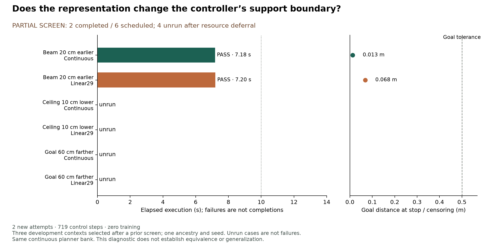

# 梁前移 20 cm：两种表示通过；另外四格资源延期

**后续状态：** 本报告保留首次 admission 的部分结果。随后独立 admission 02 已完成原四个未运行格；六格累计结果见[完成报告](SELECTION_BOUNDARY_ADMISSION02_RESULTS_zh.md)。

2026-09-19。继续[主计划](RESEARCH_PLAN_zh.md)的 continuous-versus-Linear29 完整任务比较。本轮固定三场景、两种表示共六格；**已执行两格：continuous 1/1、Linear29 1/1；其余四格未运行。** 第三个 case 的 300 s 资源门槛到期，queue 已关闭。不能把六格写成全部完成、把未运行算作失败，或用相邻项目的 continuous 结果代替我们尚未执行的配对。

## 为什么更改原先的下一步

本仓库从 `68b539726e218ab3b40d4c16a613010ac84671e1` 开始，fetch 后没有新的远端提交。相邻仓库本地已推进到 `5184085c`，其 frozen-variation screen、底层 analysis、goal-length diagnosis、代码与 TODO 已只读核对；没有修改或合并其工作区。新的发现先于本轮注册：

- 相邻 public controller 在六项 beam variation 中通过 4/6，配对 clear 为 6/6；与 aligned supplied-source clock 的成功/失败模式相同。24 次执行是相邻账本，six clear rows 实际包含四种 actor request。
- 梁前后各移 20 cm、路线方向 ±15° 的 beam task 均成功。降低梁 10 cm 时两种控制均接触；goal 加远 60 cm 时 duck 已穿越、恢复，但停在目标外而超时。
- 相邻事后共同历史诊断，在原来的 359 beam + 366 clear state 上，延长 goal 不改变任何 reference。单独物理 runs 的 floor extent 也随 goal 改变，因此它们不是纯 goal 干预。

据此，原先暂拟的 ±5 cm/shared-clear 六格，在任何新 native outcome 之前改为 **earlier200 / lower100 / farther600 三项 beam task × continuous / Linear29**。这一选择使用了先前发展结果，是有目的的诊断，不是独立 held-out sample。[新协议](SELECTION_BOUNDARY_PROTOCOL.md)和[注册](../configs/selection_boundary_v1.plan.json)保留选择依据、失败保留与停止规则。

相邻记录位于其 `docs/motion2scene/DUCK_FROZEN_VARIATION_20260919.md`；本地原始 packet 为 `/home/linjiw/research-data/m2s-duck-frozen-variation-20260919-v1`。关键绑定：`analysis.json` SHA-256 为 `ccc9f14777d914b093c13b62680d099c02198663da1d7eaccc27f435edf4e816`，`goal-length-diagnosis.json` 为 `3509eb1adcbe1dcee80e7d500f88b16e1c3a520382b4df9869cdffeb80e2cc99`。相邻结果只提供诊断动机，不并入本轮 success 或成本。

## 全部预定格子

变化均相对于前一项 familiar earlier-100mm beam pilot；earlier200 表示在它的基础上再前移 20 cm。

| 场景 | Continuous | Linear29 | 本轮证据 |
| --- | --- | --- | --- |
| 梁前移 20 cm | 成功，359 ticks / 7.18 s | 成功，360 ticks / 7.20 s | 两者均全身离开、恢复并完成新 50 tick hold；禁止接触力 0 N |
| 梁降低 10 cm | 未运行 | 未运行 | Continuous case 的资源等待到期，未启动 native |
| Goal 延长 60 cm | 未运行 | 未运行 | 队列随前一项资源延期停止 |

已完成这对的最终 goal 距离为 0.012542 / 0.068452 m，速度为 0.044231 / 0.020041 m/s；goal050 与停止阈值均未改变。两者选择 local_duck；replans 都是 71，retimed 为 21 / 25，support rejections 为 18 / 19。0.02 s 时间差只作描述，不解释为效率差异。

## 对照与独立审计

旧 codec packet 的全部绑定仍成立；新 packet 共绑定 **293 个文件**，复用原 bank、Linear29 decoded bank、native callback、selector、checkpoints、seed 和 scorer。两种方法的 planner 均保留完整 continuous 数据，q/qdot 到 motor 时才改变；scale、两帧 anchors、root 和 committed source indices 未重调。

启动前，三项相邻 continuous 历史共 **932 state** 的 reference、source indices 和 selector counters 精确复现。这不是本轮 932 次执行。新 continuous 的 reference、proprio、token、action、pre-action pose、dynamics、contact 和几何 features 与相邻 earlier200 原记录完全一致。Continuous/Linear29 的 reset、action history、proprio、dynamics、RNG、初始候选及成本完全一致；后续各自访问自己的物理状态。

两次新执行的全部 task score 均从 measured body poses 与四个 substep contact 独立复算。**719 个本轮实测 state 的全部 reference、十帧 source indices、候选及 counters 精确复现。** Linear29 的 dense planned q 最大改变 0.419777 rad、qdot 最大改变 5.446972 rad/s，说明 treatment 确实生效；这些不是实际关节跳变。

## 事后离线诊断：goal 信息是否影响发出的运动

在这两条新的 shifted-beam 历史上，固定每个 measured state、地图及每个 selector 的已承诺前缀，比较原 goal 与沿原方向加远 60 cm 的 goal。同时检查 continuous 和 Linear29 两种 reference 处理。共有 **359 + 360 = 719 个记录状态；每个状态分别检查两种表示**，不是独立任务样本。

结果：两种表示各自的 changed-reference rows 都为 **0/719**；候选和 source indices 也不变，reference 最大差异为 0。每条历史的实际 method / actual goal reference 同时与原发出值精确相等。[公开诊断](../results/selection_boundary_goal.json)及[源码](../scripts/audit_boundary_goal_response.py)保留这一事后分析的范围。

这支持一个窄判断：在这些共同历史上，当前选择器加这两种表示没有提供目标距离响应。没有执行 alternate-goal physics，也没有补足 deferred farther600 的完整任务结果。不能由此宣称所有目标、所有库都无响应，或任何 tokenizer 都不可能影响终端位置。保真 LLM sidecar 也不能替代尚未实现的 distance-responsive exit/stop。

## 成本与未完成工作

本轮账本：**2 native attempts、719 control steps、2,876 physics contact samples，66.6214 s native process wall time**；零 process failure、零 retry、零 teacher-action query、零训练。4 格 unrun。第三格等满注册的 300 s，未取得两个连续合格资源 sample；保留完整 wait ledger 与 resource-deferred receipt。Queue 已关闭，不在同一 packet 重启或延长等待。等待、离线审计与制图不包含在上述 native wall time 中。

本地不可覆盖 packet：`runs/selection_boundary_20260919_v1/`。公开[aggregate](../results/selection_boundary.json)含全部状态、reference replay 与本地证据 hashes；motions、decoded descendants、逐帧轨迹和模型继续留本地。Planner 仍存完整 continuous bank，motor 接口仍发 640D float；没有系统存储或带宽节省的实测结论。

当前没有在已执行 shifted case 中发现 Linear29 的全任务退化。尚未完成两种已知失败条件下的表示比较，更不能宣称两种表示有相同支持边界或统计等价。

1. **首先补齐主比较。** 下一独立 admission 只继承 lower100/farther600 四个未运行格，冻结所有对照、阈值、seed 与表示，引用本次已关闭 receipt；不重跑已完成的两格，不增加场景搜索。须在执行前另存资源启动与剩余预算登记。
2. **并行准备下一机制，暂不新训练。** 按[距离响应门槛](DISTANCE_RESPONSE_GATE_zh.md)标注真实 exit/stop segment、检查 support/seam 与共同历史 goal response；取得连续参考支持后才比较 public composition 和 Linear29 的保留情况。
3. 更低梁的动作覆盖、blocked-state 的物理响应另作问题，不能靠包络重叠阈值或语言接口自动补足。Vision/LLM 仍是未来扩展。

本轮本地全套测试 **66 passed**；新测试覆盖“复现的失败对照仍继续比较”、对照不匹配阻断及 closed queue 禁止再启动。实际 offline/physical audit 是本轮主要运行验证；测试通过不替代任务证据。
