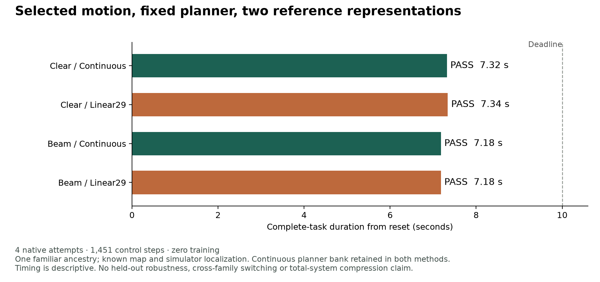

# 已知地图下自主选择动作：continuous 与 Linear29 各 2/2

2026-09-19。沿[主计划](RESEARCH_PLAN_zh.md)推进 2×3 矩阵第三行的首个熟悉场景子面板：固定 public-state selector，自 reset 选择 nominal/duck 并按实测状态重定时，仅改变发给 motor 的 q/qdot 表示。**四次 native 执行全部完成；continuous 2/2、Linear29 2/2。** 这次不再向 selector 提供正确 clip、phase、在线 teacher future 或 teacher action。

这是已知地图、模拟器零延迟定位、一个熟悉 source ancestry 的非学习控制器结果。库内全动作已有示范，reset 仍继承旧场景的 motion 初始化；不是独立动作族拼接、任意新场景、视觉导航或鲁棒性证明。两种方法都保留完整 continuous planner bank；本实验隔离 motor-reference 表示，不隔离“压缩整个规划器”的效果。

## 复用相邻研究，固定本轮对照

本仓库从干净 `e77c0b12a8df1cd7a357af9edce3062f16caf25e` 开始；fetch 后无远端差异。相邻仓库已推进到 `273970f1955535004a76ed7453d184a75461e5d3`，其 `DUCK_WHOLE_MOTION_SELECTION_20260918.md` 及底层 bank、analysis、independent audit、index correction 已读取。本轮不修改该工作区，也不合并其四次物理记录到我们的账本。

相邻项目已有 00976 nominal/local_duck 两个候选、每个 499 个 50 Hz frame，来自同一 ancestry；它也已用当前 state/goal/map 选择和执行它们。我们直接复用 bank、selector 与 executor，仅新增版本化 codec adapter。[协议](SELECTION_CODEC_PROTOCOL.md)及[四次预算登记](../configs/selection_codec_v1.plan.json)在新结果之前保存；新的本地 packet 为 `runs/selection_codec_20260919_v1/`。没有重建/重新筛选来源，也没有调 codec scale 或 selector 参数。

| 只读相邻记录（相对其仓库根） | SHA-256 |
| --- | --- |
| `docs/motion2scene/DUCK_WHOLE_MOTION_SELECTION_20260918.md` | `7b71071146080db7239032f1e374ff519183eca41319c1ebfa3b89b4a52a98da` |
| `docs/motion2scene/evidence/duck-whole-motion-selection-20260918/analysis.json` | `a35b12ed5d3f3eba28e6139c9d1155601440ef5461a4df5deb21bc15fd1fcd5c` |
| `docs/motion2scene/evidence/duck-whole-motion-selection-20260918/index-correction.json` | `524b34c72adc9004f24a118220294dcaceed4e132638c2f12f744c63f23cf408` |

## 先过接口，再计物理结果

启动前，新 continuous 路径在 **725 个旧 public-controller state / 7,250 个 horizon sample** 上逐项复现 reference 与更正后的 source indices，误差为 0。原 cursor 在 retiming 后可能表示新 tail 的坐标；本轮通过 actual committed indices 保留前缀，不能用一个标量 cursor 重建执行参考。

Linear29 采用冻结 12-bit scale，通过 joint name 转到 native 顺序，在 frame 2,7,…,497 编码，共 100 knots；前两帧 anchor、原 planned root rotation 均保留。qdot 按 native 50 Hz 前向差分重建，最后一帧使用 loader 的倒数第二个差分。这个端点约定与原库逐位相同；不是换一套速度规则给 codec 额外优势。

两次新 continuous control 的 reference、proprio、native token、action、pre-action pose、动力学、接触及 duck geometry features 均与相邻的旧 physical control **完全一致**。每对 continuous/Linear29 的初态、动作历史/proprio、动力学和 RNG 也完全一致，初始候选和评分相同。之后各自访问不同物理状态并可能产生不同 retiming，这是闭环处理效应，不是后续每一步都配对同一状态。

## 完整任务结果

| 场景 / 表示 | 所选候选 | 完整任务 | Control steps / 时间 | Replans / retimed | Support 拒绝 |
| --- | --- | --- | ---: | ---: | ---: |
| Clear / continuous | nominal | 成功 | 366 / 7.32 s | 73 / 23 | 15 |
| Clear / Linear29 | nominal | 成功 | 367 / 7.34 s | 73 / 25 | 20 |
| Beam / continuous | local_duck | 成功 | 359 / 7.18 s | 71 / 21 | 18 |
| Beam / Linear29 | local_duck | 成功 | 359 / 7.18 s | 71 / 25 | 21 |

沿用 goal050、15 tick 直立恢复后新 50 tick stop、500 tick deadline，以及全身离开与禁止接触条件。独立从 recorded body poses 重建包络、从每步四个 physics substep 计算禁止接触力，再运行冻结 scorer，**全部 score 字段精确复现**。四次均无跌倒，最大记录障碍力/非脚地面力为 0 N。该熟悉 beam 是相邻旧 earlier-shifted context，不是本轮新采样的 held-out scene。

随后对 **1,451 个本轮实测状态**独立 replay selector、编码及索引：每个 issued reference、十个 source indices、候选及 selector 计数均精确复现。Linear29 并非未生效：在其访问的 dense planned chunks 上最大 q 差 0.4198 rad、qdot 差 5.4470 rad/s。它们是参考量，不是实体关节跳变；也不能由这些最大值断言运动细节不重要。每个候选仍有 400/2,900 个 knot symbol clipping；未为本轮重拟合 range。

## 成本与结论

本轮独立账本：**4 attempts、1,451 control steps、5,804 physics contact frames；零失败 native attempt、零重试、零 teacher-action query、零训练更新**。启动时绑定 218 个输入/源码文件，使用原 serial resource gate。旧 8-episode reference、16-episode handoff、相邻项目和历史 168-attempt 余额分别保留。每格只有一次 execution，0–0.02 s 时间差只是描述，不做速度、等价或统计泛化结论。

每个候选的关节逻辑 payload 为 34,800 bits knots + 1,856 bits reset anchors；这不包括 root、索引、geometry/support、模型或容器。**完整 continuous bank 仍供 planner 使用，motor 接口仍发送解码后的 640D 浮点 reference。** 因此不宣称实际传输带宽、系统存储或总获取成本下降。这里测的是选择后的表示扰动是否破坏任务。

当前结果支持保留简单 Linear29：在已知地图、熟悉 reset 的这个小型 controller 中，它未破坏两项完整任务。它不证明 RVQ 也可用、压缩过的 planner 会同样选择、深度/LLM 前端已可控机器人，或跨动作族 seam 已获资格。BFM/VLA 接口的实质进展是：**目标/地图选择 → 带正确时基和承诺索引的 reference → 冻结 motor**已有一个可审计的闭环比较。

## 下一项研究

先冻结当前 controller 和 codec，测试场景变化，暂不训练更复杂 tokenizer。第一轴建议仅改变横梁沿行进方向的位置：相对本轮 beam 的前/后各 5 cm，另保留一个共同 clear control；两表示合计六个 primary cases，须新登记后执行。保留全部固定场景，不按某方法结果筛掉失败；共用 clear 不能计成两项独立任务。先完整公开已知地图，新的 incoming distance/速度、梁高度/长度、扰动和感知延迟另作后续条件。

若两种表示一起失效，先定位完整库动作与障碍的相对时序、支持覆盖或 blocked/replan fallback；若 continuous 成功而 Linear29 失败，再区分 clipping 与低频重建。新放置的开发场景也不自动构成 held-out 泛化。在 varied complete-task support 建立前，不做学生拟合、LLM 物理扩展或跨族拼接 sweep。

## 复现与公开范围

代码入口：[准备/运行](../src/hindsight_motion/selection_study.py)、[codec](../src/hindsight_motion/selection_codec.py)、[native adapter](../src/hindsight_motion/selection_codec_native.py)、[独立 scorer](../src/hindsight_motion/selection_report.py)及[reference replay](../scripts/audit_selection_codec_replay.py)。公开 [aggregate](../results/selection_codec.json)与[replay audit](../results/selection_codec_replay.json)只有标量与 hash。Motion bank、解码 descendants、逐帧 reference/action/contacts 和 checkpoint 留本地。

准备/运行 packet 均拒绝覆盖；已用完四次预算，不直接重跑示例命令。单元验证覆盖 named scale、原 endpoint、committed-index 分叉、未知字段拒绝及 exact-control gate；本轮受影响测试 10 个通过。图由 `scripts/plot_selection_codec.py` 从公开 scalar JSON 生成。
